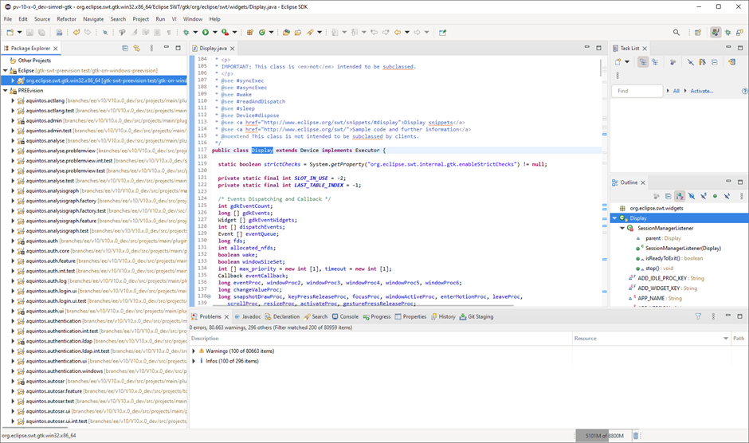
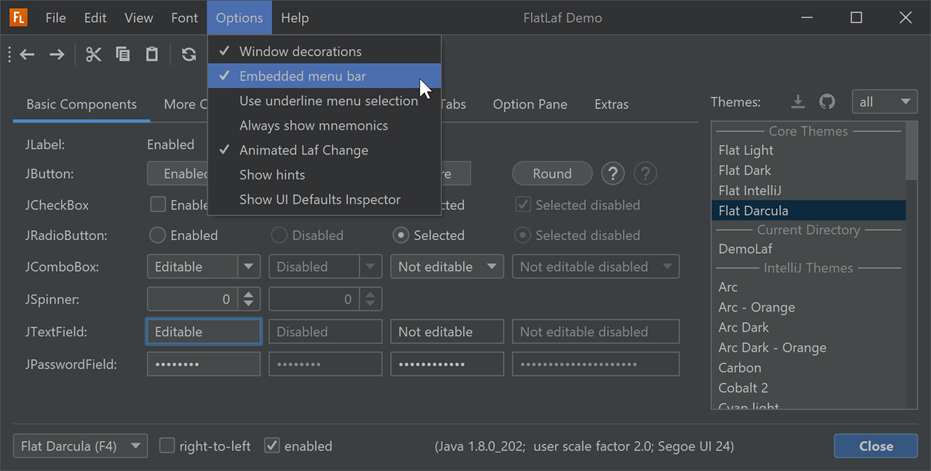
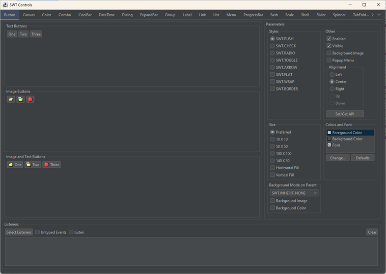
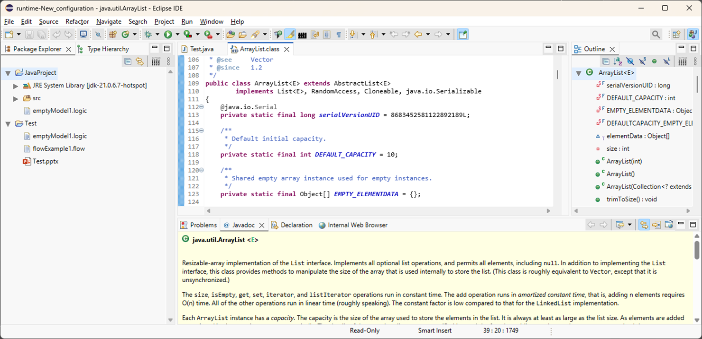
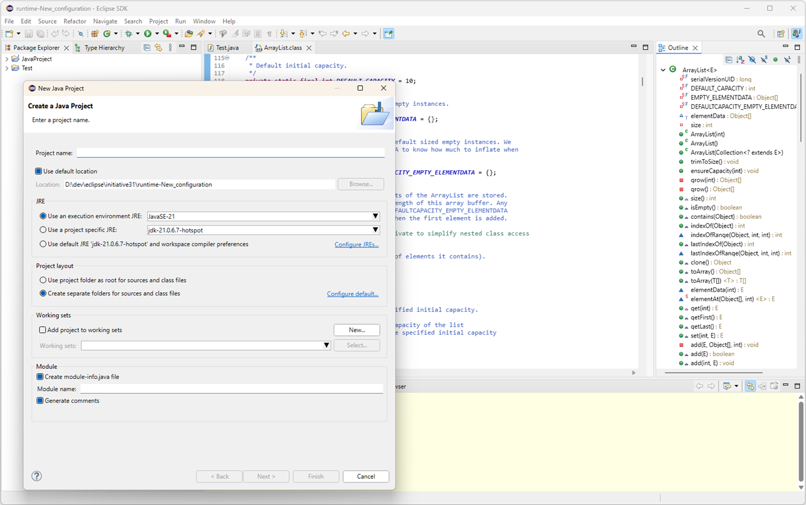
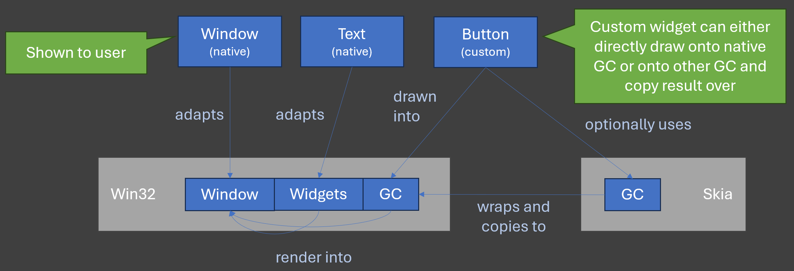

# Initiative 31 Project Report

> **_Executive Summary_** \
> Initiative 31 is an evaluation project for the long-term sustainability of the Eclipse Standard Widget Toolkit (SWT), the Eclipse Platform, and products built on top it. SWT currently relies on three separate, OS-specific implementations, resulting in high maintenance effort and limited control over look-and-feel and customizability. \
> The project assessed a broad range of technologies for a new, OS-independent implementation of the SWT API. From this landscape, three candidates (GTK, Swing, and Skia) were explored through prototyping. The Skia-based approach, combined with custom-implemented widgets, emerged as the most promising path forward. \
> The Skia prototype was subsequently extended into a functional demonstrator capable of rendering all widgets using Skia while still launching and operating the Eclipse SDK. Additional targeted prototypes addressed key risks, including performance characteristics and event-handling behavior. \
> As a result, the project concludes with high confidence that a custom-widget SWT implementation powered by a rendering engine such as Skia is technically feasible. Completing this work to production quality is no longer a matter of conceptual or technological uncertainty, but rather of execution effort. \
> Initiative 31 was initiated and driven by members of the Eclipse IDE Working Group on a voluntary basis, without central funding. The resources available were insufficient to advance the demonstrator to a full production-ready implementation within the desired timeframe (approximately two years). \
> The project’s findings have been consolidated in a report which outlines the steps required to build a complete SWT implementation based on the demonstrator, and estimates the capacity needed to carry it out. The demonstrator, along with prototypes of all evaluated technologies, is publicly available on GitHub.

## Overview

Initiative 31 is an evaluation project for the long-term sustainability of the Eclipse Standard Widget Toolkit (SWT) and the Eclipse Platform. It evaluates technology candidates regarding their applicability for a new implementation of the Eclipse SWT layer that is (as far as possible) independent from the operating system. It is driven by the need to ensure long-term maintenance and attractiveness of Eclipse SWT and the Eclipse Platform by overcoming the limitations and high maintenance efforts for the three existing SWT implementations that exist for the major operating systems Windows, Linux and MacOS. This report summarizes the motivation and results of the project and serves as a proposal for the actual development and finalization of an OS-agnostic SWT implementation based on the results of Initiative 31.

In comparison to the existing SWT implementations that use OS libraries and widgets, a technology for a potential new implementation should already deal with and hide OS specifics, such that an SWT implementation does not have to care about the underlying OS anymore. To this end, the technology must be capable of providing the same features as the union of the existing SWT implementations. In addition, it should be an enabler for further improvement, such as better customizing and theming options, better web integration via web assembly, sophisticated multi-monitor HiDPI support and the like.

The primary result of Initiative 31 is the successful demonstration of the feasibility to develop a new, API-compatible SWT implementation based on an OS-agnostic technology to unify the three existing SWT implementations with one. In case of Initiative 31, the chosen technology on which feasibility is finally demonstrated is the graphics library Skia together with a custom implementation of the SWT widgets. Core benefits of such a solution are:
- the reduced maintenance to a single SWT implementation
- the reduced dependencies to just a graphics library with a lean interface, which reduces the risk of losing compatibility as the used graphics library can easily be exchanged
- the more consistent behavior across operating systems, reducing unexpected inconsistencies and testing efforts
- the enablement for improved and customized look and feel and behavior of widgets based on their custom implementation with exchangeable renderers and functionalities

The report consists of the following parts:
- [Goal](#goal): the actual goal of Initiative 31
- [Setup](#setup): how the project was initiated and conducted from an organizational perspective
- [Technologies](#rechnologies): the technologies that were evaluated
- [Results](#results): the core results of Initiative 31
- [Realization Plan](#realization_plan): a plan for an actual realization of a new SWT implementation based on the results of Initiative 31

All information about the project and the artifacts developed in it are available in the repositories of the according GitHub organization: https://github.com/swt-initiative31/

## Goal

The primary goal of the project was to evaluate if it is possible to develop an OS-agnostic SWT implementation that can replace the three existing implementations with the same set of features in a fully API-compatible way. With such an implementation, it should be possible to achieve these three goals:
- Reduced maintenance effort by only having a single implementation that is easier to maintain
- Enablement for enhanced look and feel by becoming independent from native widgets
- Improved customizability for example via exchangeable or configurable widget renderers, full CSS support and the like

The essential questions for the evaluation of candidate technologies were:
- Is is possible to implement the full SWT API in a compatible way with that technology?
- Which risks exist regarding crucial functionality (e.g., browser integration, complex and custom widgets such as `StyledText`, SWT event loop integration etc.)?
- How much effort is necessary to provide a complete implementation?

While the ultimate goal of the project could have been a complete OS-agnostic SWT implementation, it was clear from the beginning that sufficient developer capacities would be necessary to move from prototyping to actual realization. It was thus the first goal to provide insights about whether such an implementation is feasible and reasonable. To this end, the project should evaluate and generate founded estimates if and under which conditions (required capacities and skill sets, accepted risks) this would possible. The results should serve as a means to make an educated decision on whether one or multiple technologies are suitable for an actual implementation of SWT using those technologies and, in case multiple fit, which of them fits best. Even without a full, OS-agnostic SWT implementation based on the insights, the results are valuable to have a plan for the eventual situation that the existing SWT implementations are not sufficient anymore (become incompatible, do not fulfill consumers requirements or the like).

It was an explicit _not goal_ to directly enhance the look and feel but rather to preserve compatibility as far as possible to increase acceptance first. The goal was to serve as an _enabler_ for enhanced look and feel and, for example, provide CSS styles or different renderers for the new implementation that demonstrate the capabilities right away.

## Setup

The project was initiated and driven by the Eclipse IDE Working Group members. It started with participants from the member companies in May 2024. After closing the initial technology evaluation phase in October 2024 and publicly presenting the results, it extended to a more public project (while it was not actively restricted but also not that much promoted before) with further participants from outside the Eclipse IDE Working Group.

### Collaboration

All contributors to the project participated as volunteers. There was no central funding for the project.

The organization happened via a GitHub organization: https://github.com/swt-initiative31

Weekly online meetings of about an hour were used to share insights and results and to discuss ideas or issues.

The average amount of investment is estimated at 3 to 4 full-time-equivalent developers while the total number of involved people was more than 20.

### Phases

The project was split into multiple phases:
- **Preparation (Feb-Apr 2024):** definition of project goals, technology research and initial technology candidate selection (on paper base), agreement to start project in Eclipse IDE Working Group
- **Initial Prototyping (May-Oct 2024):** prototyping with three technologies, focus on critical features/capabilities with goal of selecting most promising technology
- **Extended Prototyping (Nov-Dec 2024):** prototyping reduced to two technologies with a final selection of the one technology to proceed with
- **Feasibility Demonstration (Jan-Jul 2025):** demonstration of the feasibility of implementing SWT with the selected technology; implementation of critical points to mitigate known and unknown risks; creation of a minimum viable demonstrator with finally rendering all widgets with the new graphics library

After the last of those conducted phases, risks were significantly mitigated and feasibility was demonstrated, such that the remaining path to a full SWT implementation is rather a matter of capacities than of conceptual or technical/technological uncertainties. The involved parties were not able to invest the necessary capacities to realize a full implementation in a timely manner. Due to that, it was not reasonable to start another phase but to conclude the project with the successful feasibility demonstration for now, which allows to proceed with the actual implementation at reduced risk, based on a working demonstrator and with knowledge about the parts to implement.

### Incrementality

The prototyping work and feasibility demonstration was conducted in an incremental way. The goal was to ensure at every point in time that products based on top of Eclipse SWT and the Eclipse Platform can still be executed with the incrementally extended SWT implementation. To this end, existing native widgets were kept working while they were successively replaced with custom widget implementations based on the chose technology Skia.

## Technologies

### Preselection and Criteria

Technologies were initially collected via an exploratory research and classified regarding relevant criteria for the project. 
They were identified via a systematic web search, also using the wikipedia lists for [widget toolkits](https://en.wikipedia.org/wiki/List_of_widget_toolkits) and [graphics libraries](https://en.wikipedia.org/wiki/Graphics_library).

Relevant criteria were defined as follows:

**Functionality**
- Can fulfill existing API (even OS-specific ones), e.g.,
  - support multiple `Display` instances (Windows feature)
  - embed native window handles
  - embed SWT/AWT widgets
- Java bindings / usable from Java
- Browser integration possible
- *Optional:* Executable in a browser (e.g., via WebAssembly)

**Quality**
- Open source, compatible license
- Actively maintained and widely adopted
- Mature at least on Windows, MacOS and Linux

At least the following technologies have been excluded because of those criteria:
- Interesting but not fulfilling at least one of the criteria: [QT](https://en.wikipedia.org/wiki/Qt_(software)), [Fyne](https://en.wikipedia.org/wiki/Fyne_(software)), [Flutter](https://en.wikipedia.org/wiki/Flutter_(software)), [AWT](https://en.wikipedia.org/wiki/Abstract_Window_Toolkit), [wxWidgets](https://en.wikipedia.org/wiki/Abstract_Window_Toolkit), [JavaFX](https://en.wikipedia.org/wiki/JavaFX)
- Not interesting as outdated and/or not widely adopted: [CEGUI](https://en.wikipedia.org/wiki/CEGUI), [FOX toolkit](https://en.wikipedia.org/wiki/FOX_toolkit), [XForm](https://en.wikipedia.org/wiki/XForms_(toolkit)), [XVT](https://en.wikipedia.org/wiki/XVT), [Clutter](https://en.wikipedia.org/wiki/Clutter_(toolkit)), [Elementary](https://en.wikipedia.org/wiki/Enlightenment_Foundation_Libraries), [IUP](https://en.wikipedia.org/wiki/IUP_(software)), [Tk](https://en.wikipedia.org/wiki/Tk_(computing)), [FLTK](https://en.wikipedia.org/wiki/FLTK), [Juce](https://en.wikipedia.org/wiki/Juce), [U++](https://en.wikipedia.org/wiki/Ultimate%2B%2B)

### Prototyped Technologies

The following three technologies passed the initial preselection and were chosen for the initial prototyping phase: GTK, Swing, and Skia

#### GTK3/4

GTK (GIMP toolkit) is a popular open-source widget toolkit primarily used on Linux. Written in C, GTK is used by major desktop environments like GNOME and by cross-platform applications such as GIMP. GTK is already utilized in the SWT implementation for Linux. Although GTK is primarily used on Linux, it has been ported to other platforms (including Windows), making it a suitable choice for cross-platform applications.

**Major Benefits**
- SWT implementation exists -> low-hanging fruit, fully compatible
- Widely adopted and actively maintained
- Native customizing via CSS, themes available
- GTK4 implementation required anyway

**OS Ports**
- Windows: mapping to Win32 API exists, e.g., via MSYS
- MacOS: mapping based on Quartz backend (X Windows Server Port), e.g., via homebrew

#### Swing

Swing is a lightweight widget toolkit shipped with the JDK. It is purely Java-based and thus only requires knowledge in the programming language that is used by Eclipse/SWT developers anyway. It is easily deployed with the JDK/JRE and used by up-to-date tools like IntelliJ.

**Major Benefits**
- Purely Java 
- Java-native platform independence
- Easy deployment (via JDK/JRE)
- Developer availability
- Used by IntelliJ / maintained by Oracle
- Customizable look & feel, existing themes

**Existing Prototype**
- SWTSwing is an existing prototype
- [Eclipse Issue Tracker](https://bugs.eclipse.org/bugs/show_bug.cgi?id=69930), [Eclipse Forum](https://www.eclipse.org/forums/index.php/t/145268/)

#### Skia

Skia is a mature 2D graphics library used as the graphics / rendering engine for several modern desktop applications, such as Chrome, Firefox, Thunderbird, Android, LibreOffice, and others. Still, Skia is only a graphics engine providing drawing capabilities. It does, in particular, not provide widgets, which is why it needs to be combined with any widget framework on top of it.

**Major Benefits**
- Fast, mature, widely adopted, and future-proof: The number of applications using it emphasizes its maturity and gives some certainty that it will continue to exist and to be maintained
- Features: GPU-supported rendering, SVG support, enabler for WebAssembly deployment, etc.
- Platforms: major desktop OSes (Windows, MacOS, Linux) but also mobile platforms (iOS, Android)
- Potential combination with other Skia-based products (e.g., LibreOffice, Chrome, Firefox, ...)
- Easy exchange as it's only a graphics library with a lean interface (implemented as SWT's `GC`)

**Widget Framework Options**

As Skia is only a graphics library, widgets must be implemented on top of it. There are some options for existing widget frameworks using Skia:
- Visual Class Library (VCL) by LibreOffice
- Flutter (quite young, fast evolving, thus risky to adopt)
- Custom-implemented

## Results

### GTK: Dropped

The GTK implementation has reached a state where at least on Windows sophisticated Eclipse applications could be executed on GTK 3. Since the GTK 4 support of SWT was not in a good shape while the prototyping work was done and since the GTK 3 support for MacOS is limited, no proper demonstration for MacOS beyond simple snippets was achieved.

Some concerns regarding the usage of the GTK implementation were the limited performance of specific widgets (such as trees) and missing support for multiple `Display` instances (a feature of SWT on Windows that some consumers rely on). At the end, there was no real exclusion criterion for GTK but the interest at the involved participants for the Skia prototype was higher and in addition work was started on GTK 4 support in SWT independent from Initiative 31.

The full initial report on GTK can be found here: https://github.com/swt-initiative31/documents/blob/main/results/gtk.md \
The initial prototype implementation can be found here: https://github.com/swt-initiative31/prototype-gtk 

### Swing: Dropped

The existing SWT Swing implementation looked quite promising as most widgets were already in a good shape. However, some essential features like browser integration are missing. Finally, the prototype was not further developed because of lack of interest at the participants. Since acceptance of a technology is a crucial criterion for its adoption, we chose to drop the technology.

The full initial report on Swing can be found here: https://github.com/swt-initiative31/documents/blob/main/results/swing.md \
The initial prototype implementation can be found here: https://github.com/swt-initiative31/prototype-swing 

### Skia: Developed

The Skia implementation started with the adoption of an existing widget framework (VCL from LibreOffice). However, it turned out soon that this choice would not have had any benefits compared to existing SWT implementation. \
The full initial report with a summary of the insights on this prototype can be found here: https://github.com/swt-initiative31/documents/blob/main/results/skia_vcl.md \
The initial prototype implementation based on VCL widgets can be found here: https://github.com/swt-initiative31/prototype-skiavcl

The prototyping work was then realigned to use Skia (more precisely the Java bindings Skija) but to develop every widget as a custom implementation using SWT's `GC`. \
The final prototype implementation with custom-implemented widgets, which is also the final overall demonstrator of Initiative 31, can be found here: https://github.com/swt-initiative31/prototype-skija

#### Benefits
The benefits of the implementation of custom widgets were:
- Productivity of the involved developers was very high from the beginning as everything happened in pure Java and was easily debuggable
- Work could be done incrementally to a high degree by replacing one widget and one functionality after another
- All widgets moved to an implementation with very lean dependencies: they primarily depend on drawing capability from SWT's `GC` then, which adapts Skia but could easily be replaced with any other graphics engine if desired or necessary.

#### Achievements

In the final state of the Skia-based prototype with custom-implemented widgets, a preliminary implementation for every widget exists. The following screenshots show how an Eclipse SDK looks like when almost fully rendered with Skia:

The following topics and risks have been addressed and mitigated by the prototyping work, either by implementation according functionality in the overall prototype or by implementing a dedicated prototype for that specific topic:
- **Widget Completeness:** For almost every widget a preliminary custom implementation exists, showing that this widget can be replaced.
- **Complex Widget Support:** The ability to support complex widgets has been demonstrated at the example of the `StyledText`. It has been adapted to work with Skia to a high degree. The rendering fully happens with Skia, but the result is not perfect yet in terms of alignments and the like.
- **Event Handling:** OS-independent event handling has been evaluated in a separate prototype showing the feasibility of implementing fully custom event handling.
- **Ski(j)a GC Capabilities:** Many GC functionalities have been implemented based on Skia, showing the feasibility to implement the full `GC` API as a core element of the graphics library adaptation approach.
- **Rendering Performance:** The decent performance of rendering in a hardware-accelerated mode (using OpenGL) and via rendering into an OS buffer has been shown in dedicated prototypes.
- **OS Independence:** The implementation has been frequently successfully tested and adapted to work on every operating system.
- **Rendering Customizability:** The customizability of rendering widgets has been evaluated with the provision of exchangeable renderers for several widgets.

#### Incrementality

The replacement of widgets and functionality happened in an incremental way. It was the goal to keep the SWT control example project and the Eclipse SDK working at every point in time. The project has shown that this kind of work is possible in an incremental way. The incremental adaptation concept for widgets to be custom rendered can be sketched as follows:

### Follow-Up Tasks

At least two follow-up tasks have been identified that will provide benefits even without achieving a full SWT implementation based on Skia.

#### Skia-based GC in SWT
Since the `GC` implementation in SWT lacks good performance (in particular on Windows), being able to use Skia for performing rendering operations via a `GC` on a pure canvas would be beneficial. A potential use case are diagrams drawn with the graphical editing framework (GEF).
The work on this has been separated into its own repository and is supposed to be contributed to the current SWT implementations: https://github.com/swt-initiative31/skija-canvas

#### Custom Widgets
Some of the custom widget implementations are already or will potentially become superior to the existing native ones. Such widgets might be contributed to the existing SWT implementation either as separate custom widgets or even as replacements for native widgets (like already done now with some emulated widgets that do not have a native representation on some operating systems).

## Realization Plan

With the prototype based on Skia and custom-implemented widgets, feasibility of achieving a full implementation based on that technology has been demonstrated. Risks have systematically been analyzed and mitigated by a minimum viable demonstrator, incremental widget creation, and risk-specific prototypes. 
The prototype is available here: https://github.com/swt-initiative31/prototype-skija

### Capacity / Effort

Based on these results, the development team can confirm with high confidence that a full implementation is only a matter of capacities.
The capacity required to achieve a full implementation is difficult to estimate due to the high amount of specific behavior the current OS-specific widgets provide. It's also a matter of decision how much of those capabilities are actually required and which of them should not be provided in a new implementation at all to streamline and simplify the behavior as much as possible.
The minimum estimate for the required effort to achieve a full implementation that is usable by most consumers is 20 person years.

Given the average total investment to the prototyping work of around 3 to 4 full-time-equivalent developers, the time it would have taken to finalize the project was multiple years and thus too long for the involved people and companies to further invest once feasibility of the approach was shown. As soon as there is a critical number of people and/or companies that could invest the required effort to finalize the work in a reasonable time frame (which was by most participants considered as 2 years), the work could be continued and finalized. Our recommendation is to only start this work if at least ten full-time-equivalent developers are available.

### Content / Steps

In the current prototype, a preliminary implementation of all widgets and a sufficient adaptation of the Skia graphics library via SWT's `GC` exists. Still, these widgets are backed by native widgets that are fully rendered by the SWT implementation instead of the operating system.
The steps to proceed are:
- **Event Handling:** Customize the event handling that is currently still performed to a large degree by the operating system. This includes all interactions with the widgets, such as keyboard/mouse interactions, focus/selection handling and the like. There is a prototype in the repository for demonstrating feasibility of fully custom event handling.
- **One Canvas:** The current backing of every widget by a native one needs to be replaced with a single native canvas that is fully rendered by the SWT implementation. This reduces the OS dependency and improves the performance but also requires to implement custom calculations for the areas to refresh upon content change, move/resize operations and the like.
- **Full GC:** The SWT `GC` implementation is the core of the Skia adaptation, as the rendering of all widgets is done via calls to a `GC` instance for drawing primitives like lines and circles or text. It is currently finalized to the extent that was necessary to implement the desired parts of the rendering. The implementation needs to be finalized such that every methods provided by the existing `GC` implementations provides the same functionality.
- **Performance Improvement:** Skia is a very efficient rendering engine so that it will be possible to improve the rendering performance compared to at least those existing OS implementations that do not use hard acceleration. This has been demonstrated by dedicated prototypes on which the performance of, e.g., text rendering operations has been compared. In general, the current prototype is not optimized for performance yet. In particular, the rendering currently happens on a custom canvas that is copied to an OS buffer, which needs to be replaced by rendering directly into an OS buffer or a hardware-accelerated buffer. Dedicated prototypes for some operating systems are available in the repository.
- **Widgets Finalization:** While the current prototype already contains a preliminary implementation for every widgets that provides the basic functionality, there is still plenty of work remaining to make every widget provide all the (relevant) capabilities of their current native implementations. This work can be perfectly done in an incremental manner to exactly the required degree and it can even be beneficial without a full Skia-based implementation if some of those widgets reach such a good state that they could even be used with the current native SWT implementation to provide an optimized version of specific widgets.

## Conclusion

This report has summarized the motivation behind, the conduction, and the results of the project "Initiative 31". It has also highlighted how work can follow-up on the insights of this project.
Key insights are:
- **Feasibility:** An OS-agnostic, API-compatible implementation of SWT is possible
- **Technology:** Skia in combination with a custom-implementation of widgets is a feasible way to achieve it; while the required effort is significant, the benefit will be as well
- **Incrementality:** It is possible to provide a new SWT implementation in an incremental way, i.e., keeping products using SWT working while replacing parts with the new implementation step-by-step

The participants of Initiative 31 are looking forward to finding a crucial number of peoples and/or companies that are willing to invest into a realization of a full SWT implementation based on the prototype that has successfully been developed and demonstrated feasibility as the result of Initiative 31.

## Acknowledgements

We want to thank everyone who participated in and contributed to Initiative 31 to make it such a successful evaluation project for the long-term sustainability of Eclipse SWT.

<!-- Name people explicitly? Risk of missing someone? -->
