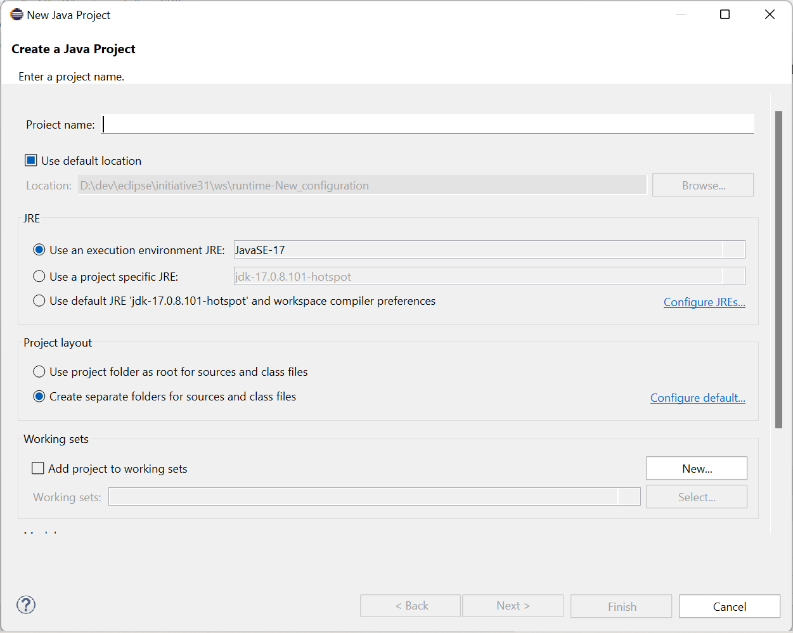

# Custom-Drawn Widgets Prototype Summary

<!--- This overall description fits for every technology, not only for Skia/VCL --->
This summary belongs to prototyping work on evaluating technology candidates to be used for a new implementation of the Eclipse Standard Widget Toolkit (SWT) layer which is (as far as possible) independent from the operating system. In comparison to the existing SWT implementations that use OS libraries and widgets, a technology for a potential new implementation should already deal with and hide OS specifics, such that an SWT implementation does not have to care about the underlying OS anymore. To this end, the technology must be capable of providing the same features as the union of the existing SWT implementations. In addition, it should be an enabler for further improvement, such as better customizing and theming options, better web integration via web assembly, sophisticated multi-monitor HiDPI support and the like.

The goal of the prototyping phase is not to completely implement the SWT layer with a specific technology, but to provide insights about whether such an implementation is feasible and reasonable. This includes a founded estimation whether or with how much effort this will be possible technology-wise, which developer capabilities are required for development and maintenance, and for what kind of improvements the technology might be an enabler. The results should serve as a means to make an educated decision on whether one or multiple technologies are suitable for an actual implementation of SWT using those technologies and, in case multiple fit, which of them fits best.

## Technology

The technology used in this prototype is plain Java. It aims at providing custom-drawn widgets to get rid of most of the (OS-specific) dependency for the UI. It is supposed to use the capabilities of the graphics canvas (`GC`) for drawing all widgets based on primitives like lines, rectangles, circles and text. This is currently already done for custom widgets like the SWT-provided `CTabFolder` or the [Nebula widgets](https://eclipse.dev/nebula/). The rendering engine used for drawing with a `GC`, currently provided by the different OS APIs, can then be exchanged with any other graphics library like [`Skia`](https://skia.org/) or anything that might be suitable in the future.

### Reasons

The overall reasons for considering the option to completely custom-drawn widgets is the independence of any third-party libraries, the control over how widgets are drawn and what capabilities they provide, and the required skill set, which mainly consists of Java knowledge and thus does not include anything beyond the usual scope of an Eclipse (platform) developer. In addition, custom-drawn widgets can be well-integrated in an iterative, incremental fashion by replacing one native widget after another once they are mature enough, until finally all widgets are replaced, so that then the underlying graphics engine can also be exchanged.

We can then benefit from the capabilities of modern, hardware-accelerated graphics engines, like Skia. Skia is a mature 2D graphics library used as the graphics / rendering engine for several modern desktop applications, such as Chrome, Firefox, Thunderbird, Android, LibreOffice, and others. Still, Skia is only a graphics engine providing drawing capabilities. It does, in particular, not provide widgets.
There are several reasons for using Skia:
- Mature and future-proof: The number of applications using it emphasizes its maturity and gives some certainty that it will continue to exist and be maintained
- Features: GPU-supported rendering, SVG support etc.
- Platforms: major desktop OSes (Windows, macOS, Linux) but also mobile platforms (iOS, Android)

Reasons for developing a custom widget framework (on top of Skia) includes:
- Control: every behavior and appearance of every widget is implemented in our code and can thus be changed easily
- Stability: there is no external, evolving dependency to which we need to adapt constantly, but can evolve the widgets on our own according to our needs
- Complexity / skill set: every developer with Java knowledge will be able to adapt and improve the widgets; complexity is reduced to the essentials of the implementation and does not require any knowledge or comprehension of existing libraries and APIs

### Details

#### Skia / Skija

- [`Skia`](https://skia.org/) is a graphics engine for rendering 2D graphics
  - It provides hardware-accelerated rendering capabilities based on Vulkan/OpenGL
  - It only allows to draw primitives, such as a lines or rectangles, and render fonts, but does not provide a widget toolkit
  - It provides sophisticated text rendering capabilities, including subpixel rendering and subpixel anti-aliasing (though a bit behind the Windows clear type rendering)
- [`Skija`](https://github.com/HumbleUI/Skija/) is a set of Java bindings for using Skia from within Java

#### Custom Widgets

- Custom widgets can be drawn using a graphics canvas (`GC`)  by drawing text, drawing primitives (lines, rectangles etc.), or just setting pixel values
- The implementation of the `GC` currently uses operating system APIs (Win32/GDI, Cairo, Cocoa, ...), but could be replaced by some other library (like Skia) once other widgets do not depend on OS APIs anymore
- SWT already contains a number of custom widgets, like `CTabFolder` or `StyledText`, and clients can provide custom widgets by simply reusing existing ones and drawing on a graphics canvas on their own

### Required Skills

- Java knowledge
- Some UI/UX affinity to create properly looking widgets (but not required by every contributor)

## Contributors

Prototyping work has been conducted by:
- [Denis Ungemach (SAP)](https://github.com/DenisUngemach)
- [Michael Schneider (SAP)](https://github.com/schneidermic0)
- [Federico Jeanne (Vector Informatik)](https://github.com/fedejeanne)
- [Heiko Klare (Vector Informatik)](https://github.com/heikoklare)

Total time invest was about 2 person months.

## Results

The results consist of concrete prototyping work with an according process documentation and code implementation as well as insights and a risk assessment gained out of this process. The documentation and code can be found here:
- Tasks documented in GitHub issues: https://github.com/swt-initiative31/Skia/issues \
  Organized on a project board: https://github.com/orgs/swt-initiative31/projects/1/views/1
- SWT code with added custom widget implementations: https://github.com/swt-initiative31/prototype-skija

### Achievements

#### Custom-Drawn Widgets

- Several widgets have been partially custom-implemented ("partially" meaning that they provide their essential visual and interactive functionality but may not have all event handling, mnemonic handling etc. implemented):
  - Button ([Screenshots Windows](#control-example-button-windows), [Screenshots MacOS](#control-example-button-macos)): https://github.com/swt-initiative31/Skia/issues/20
  - Combo
  - Label
  - Text ([Screenshots Windows](#control-example-text-windows), [Screenshots MacOS](#control-example-text-macos)): https://github.com/swt-initiative31/Skia/issues/21
- They can even be used in an Eclipse application, i.e., Eclipse applications can be executed as usual and render the replaced widgets based on the custom implementation, see for example screenshots of the Java project creation dialog [on Windows](#java-project-creation-dialog-windows) and [on MacOS](#java-project-creation-dialog-macos)
- State of appearance:
  - Essential visual functionality is completely rendered: general shape, text, checked states for push/toggle/radio/checkbox buttons, hover indicators, carets etc.
  - Some styling options are rendered: borders, read-only and disabled states
- State of interaction:
  - Essential interaction is provided, such as handling click and selection events for push/toggle/radio/checkbox buttons, selecting text in text widgets etc.
  - Essential events are generated, such as selection and text changes
  - Essential events are processed, such that redraw and resize operations are executed as required
- Implementations of widget classes are completely independent from OS-specific APIs (see https://github.com/swt-initiative31/Skia/issues/23)
  - Only relation to OS-specific APIs is across OS-specific super class implementations (such as `Control`) and the `GC`
  - E.g., a `Button` still extends a `Control`, and `Control` is a system-specific class
- HiDPI support is implemented: widgets render properly depending on the scaling
  - Screenshots for the Java project  creation dialog on Windows can be found [here](#java-project-creation-dialog-windows-hidpi)
  - All screenshots for MacOS are HiDPI and be found throughout the [screenshots](#screenshots)

#### Skia-Based GC

- An additional OS-agnostic GC based on Skia has been implemented
  - Currently, the final user-visible result is still drawn on the OS-specific GC (as that one writes into the memory of the shown window), but the Skia-based GC can be used to render dedicated parts of the UI (complete widgets) and the rendering result is simply copied over to the OS-specific pixel-by-pixel
  - Currently this GC has to be instantiated manually (e.g., in specific widgets) and wrapped around an OS-specific GC to which the rendering result is finally passed
- Current usage process:
  - Widget rendering is started with an OS-specific GC
  - A Skia-based GC is created an wrapped around OS-specific one
  - Rendering is performed on Skia-based GC
  - Rendering result is copied pixel-wise from Skia-based GC to OS-specific GC that writes into the user-visible window
- Skia-based GC is currently implemented in `Label` and `Button`
- GCs are interchangeable
  - Additional interface for GC (`IGraphicsContext`) has been introduced to make the GC exchangeable where required
  - Widgets are implemented such that they can work with both versions of GCs (OS-specific and Skia-based one)
  - Can be exchange via a flag
  - A button was added to the SWT `ControlExample` in the prototype to switch between the two GCs on the fly
- If at some point in time the whole application was rendered with Skia (i.e., the window itself is provided by Skia and not the OS), the Skia-based GC could be adapted to directly commit changes to the application's window instead of copying the result to an OS-specific GC

#### Limitations
- Appearance is not OS-specific
  - Widgets render similarly on all operating system; currently, they are rather aligned with Windows
  - Some widgets may require some OS-specific theming to look "fitting", so that some customizing to fit into the elsewhere native UI may be required
- Theming is not implemented, so widgets may not fit to the current theme (in particular a dark theme)

### Insights

#### Complexity and Control
- Achieving working widgets with their essential visualization and functionality and an acceptable look and feel was easier and faster than expected
- Since sophisticated custom widgets like `StyledText` exist, more primitive equivalents (like `Label` or `Text`) should be quite easy to develop based on the existing implementation for such more sophisticated widgets
- The complexity is reduced when rendering widgets on our own in a unified way
  - Relieves us from OS-specific adaptations and tweaks (there is currently code for tweaks on Windows XP, Windows Vista, Windows 7 etc.)
  - Relieves us from understanding how the OS-specific APIs work
- Control over consistent behavior is increased as behavior (in addition to look and feel) can be defined in a unified way across all operating systems
  - Interaction with handlers, calling sequences etc. becomes easier to understand
  - There is no difference between event handling, listeners etc. in different operating systems anymore

#### Quality and Performance
- The visual rendering quality of OS-native widgets / text is hard to achieve
  - Subpixel rendering and subpixel anti-aliasing for text is optimized in the OS (e.g., clear type rendering on Windows)
  - This is also possible with Skia, but results are a bit behind Windows rendering; see, e.g., https://github.com/HumbleUI/Skija/issues/68
  - Double buffering might be required at some places to avoid flickering (at least on Windows)
- Anti-aliasing for custom-drawn primitives has better quality using Skia than using the OS GC (at least on Windows)
- Rendering performance
  - When rendering widgets by hand using the OS-specific GC, performance is worse than using native widgets (at least on Windows)
  - Using a Skia-based GC improves the performance again
- Several widgets are custom drawn already now, including complex widgets for tasks like diagram rendering, such that good performance should also be achievable for basic widgets with according technologies

#### Incremental Replacement
- It is possible to encapsulate everything OS-dependent into OS-specific base classes `Widget` and `Control`
  - Allows for completely OS-independent implementations of concrete widgets, even though their super classes are OS-specific
  - E.g., the custom, OS-agnostic `Button` implementation in the prototype extends the OS-specific `Control` class
- Currently, custom widgets usually extend the `Canvas` class, but with the above encapsulation of OS-specific functionality into base classes, it becomes also possible to put custom, common classes somewhere else in the inheritance hierarchy, in particular at the same places where the OS-specific implementations are placed now
- This allows to incrementally replace widgets, independent from each other, once their custom implementation is mature enough
  - Different widgets can be implemented simultaneously by different groups of people and can replace the existing widgets independently and iteratively
  - This indirectly forces a proper implementation of customizing/theming, as for the transition phase it would require widgets to be adapted to the operating systems to be well-integrated with the rest of the still native UI; this OS-specific customization might be removed later when the whole UI is OS-independent and can use whatever consistent styling is desired then
- Doing such an incremental replacement is only a option
  - It is still possible to develop custom-drawn widgets in a separate SWT implementation to avoid running into a no-way-back situation since after replacing the first OS-specific widgets with custom ones you can hardly move back to the OS-specific implementations (i.e., restore the OS-specific implementations) in case some blocker occurs later when replacing further widgets and functionality
  - Developing custom widgets in a separate SWT implementation means that this is either only done for one OS or that the number of implementations has to be doubled, as all non-custom-drawn widgets still have to be OS-specific, thus still requiring OS-specific implementations even with custom widgets until all widgets have been replaced

### Risks

#### Performance and Quality
- Performance might become a problem when rendering with OS-specific GCs
  - On Windows, the GC implementation works without hardware acceleration. Rendering every region, line and, in particular, text manually will be less performant than rendering OS widgets, which are optimized at the OS level and thus more performant
  - Using an engine with better performance for the already replaced custom widgets (like Skia) might reduce or eliminate the problem
  - Still, a mixture of rendering engines can lead to an inconsistent look and feel, due to different drawing properties such as anti-aliasing behavior, and in particular different font rendering
- As mentioned in the insights, rendering quality of fonts may degrade with other technologies than the native ones (in particular on Windows)
  - This should be solvable or acceptable, since many other tools (like browsers or other OS-independent UI frameworks) do also not use the native font rendering and still the quality is accepted

#### Dependencies
- Skija: While Skia is a mature and well-maintained project, Skija (the Java bindings for Skia) are not mature
  - Maintained by few people and only few commits per year 
  - Risk that the bindings are insufficient and need to be maintained
  - But: this is primarily an adapter to the Skia native code, so complexity of maintaining such bindings is moderate
  - The Foreign Function and Memory API (FFM) in Java 21 may be a chance to further simplify such bindings
- Other than that, following this approach will reduce the dependencies to any other libraries or frameworks (complex native APIs / widgets) and make the remaining ones rather exchangeable
  - Skia will only be used for performing primitive rendering operations, i.e., it will be rather limited to the `GC` implementation
  - The rendering implementation can be easily exchanged with other rendering engines supporting the rendering of primitives

#### Effort
- It is yet unclear how much effort it might be to implement single widgets to a state that serves as a complete replacement for the current OS-specific ones
  - The functional details of a widget can become complex
  - There may be some OS-specific functionalities that are hardly known, but may still be used by some consumers, so that they need to be implemented/replaced, but may be detected late in the development process

#### Distinction to Swing
- The result of this approach will basically be a Java-based UI/widget framework with limited external dependencies (such as a rendering engine)
- The question arises whether the gained control over the implementation of widgets outweighs the required implementation efforts, given that with Swing a Java-based widget framework already exists

## Conclusion

_Note: This prototype is still work in progress, so the results may be extended and the final assessment may change._

The insights gained while prototypically implementing parts of SWT widgets via custom rendering of primitives (lines, rectangles, text) and replacing the underlying rendering technology indicate that the approach appears feasible and suitable for achieving a single OS-agnostic SWT implementation. In particular, the efforts required to achieve a custom implementation of widgets appear to be lower than originally expected by the contributors. The current results are beyond the original expectations given the invested time.

Major benefits of this approach are:
- Significantly reduced external dependencies to only an (exchangeable) rendering engine
- Low skill set requirements, as primarily basic Java skills are required and the dependencies to other, native code (e.g., a rendering engine) are rather lean
- Increased control of appearance and behavior of widgets, as everything is implemented in the code at hand; there will not be any framework limitation (like when using an existing widget framework) that may prevent one from implementing specific features or existing tweaks required for the existing SWT implementation on which clients depend
- Increased stability as no external dependency (such as an existing widget framework) may change and lead to problems; the remaining dependency to a rendering engine is so lean that it will hardly affect overall stability

Still some risks or uncertainties with this approach remain. One is the potential reduction of rendering quality, in particular regarding fonts on Windows. This may be outweighed by the better rendering performance and quality of non-font parts of the UI. Another uncertainty are the required efforts for such an implementation, because no existing widget framework is used and only adapted but a complete implementation of every widget has to be provided. Even though the efforts during prototyping were less than expected, the overall required effort is still hard to estimate. In particular, it is unclear whether the benefits regarding control over and possibility to influence the implementation outweighs the reduced effort when using an existing framework like Swing, which may provide similar capabilities and benefits.

In order to further reduce the risk regarding efforts and quality and to improve the comparison of efforts and benefits with an implementation base on an existing framework such as Swing, we propose to extend the prototyping phase with the goal of fully implementing at least one widget to get a better impression of the efforts for completely implementing a single widget. This information may be extrapolated to estimate the efforts for replacing all widgets. Such an implementation should cover all existing functionality, including HiDPI support and theming, and may provide further customizing via CSS to demonstrate benefits of such a custom implementation. Such an implementation could even be provided as a further custom widget implementation directly to SWT (like we already have a custom `CCombo` in addition to the native `Combo` right now), not replacing the existing ones but being an alternative for the existing ones (like a `CButton` in addition to the existing `Button`), so that the invested effort pays off beyond pure prototyping work.

**Final Assessment:** In summary of this work, we consider custom-drawn widgets, in particular in combination with a modern rendering engine like Skia, an interesting technology candidate to use for a new Eclipse SWT implementation. It reduces dependencies and the required skill sets and increases control over and the ability to influence the behavior of widgets and the overall UI. Major uncertainty is given in terms of the ability to achieve a native-equivalent font rendering quality and the required efforts for implementing the approach. In order to further reduce this uncertainty, the prototyping work may be extended to fully implement at least one representative widget.

## Appendix

### Additional / Alternative Libraries

Additional libraries / stacks that might be used to implement custom rendering of widgets are listed in the following.

- [Lightweight Java Game Library (LWJGL)](https://www.lwjgl.org/) - cross-platform rendering library for Java

#### Alternative Rendering Stack

An alternative rendering stack based on 3D rendering capabilities has been used for Straylight SWT:

- [BGFX](https://github.com/bkaradzic/bgfx) - Rendering Library - BSD
- [Themable Widget Library](https://github.com/ThemableWidgetLibrary/twl) - Widget Library - BSD
- [NanoVG](https://github.com/memononen/nanovg) - 2D Drawing Library - BSD (BGFX has a NanoVG implementation. NanoVG can be used for executing drawing operations like with an SWT GC)
- [SimpleDirect Media Layer](https://github.com/libsdl-org/SDL) - Windowing Library - zlib
- [FreeType](https://gitlab.freedesktop.org/freetype/freetype) - Font Rendering - FreeType/BSDish

### Screenshots

Screenshots have been taken once based on the SWT version released with Eclipse 2024-09 on Windows and once with the same version in which several widgets (label, button, combo) have been replaced by custom, OS-agnostic implementations, see [this repository](https://github.com/swt-initiative31/prototype-skija).

The visualization of the widgets (e.g., the fills for checkboxes and radio button) have been chosen for testing purposes and can easily be exchanged with whatever visualization is desired.

#### Control Example: Button (Windows)
Existing Win32 implementation:\

Custom implementation with Windows GC:\

Custom implementation with Skija GC:\

#### Control Example: Button (MacOS)
Existing MacOS/Cocoa implementation:\

Custom implementation with Cocoa GC:\

Custom implementation with Skija GC:\

#### Control Example: Text (Windows)
Existing Win32 implementation:\

Custom implementation with Windows GC:\

Custom implementation with Skija GC:\

#### Control Example: Text (MacOS)
Existing MacOS/Cocoa implementation:\

Custom implementation with Cocoa GC:\

Custom implementation with Skija GC:\

#### Java Project Creation Dialog (Windows)
Existing Win32 implementation:\

Custom implementation with Windows GC:\

Custom implementation with Skija GC:\

#### Java Project Creation Dialog (Windows HiDPI)
Existing Win32 implementation (HiDPI, 150% Monitor Scaling):\

Custom implementation with Skija GC (HiDPI, 150% Monitor Scaling):\

#### Java Project Creation Dialog (MacOS, HiDPI)
Existing MacOS/Cocoa implementation (HiDPI, 200% Monitor Scaling):\

Custom implementation with Skija GC (HiDPI, 200% Monitor Scaling):\
