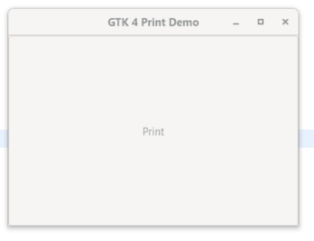
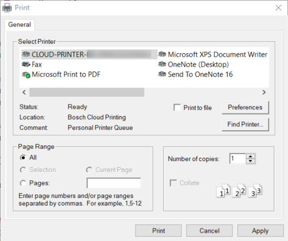
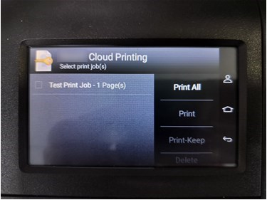
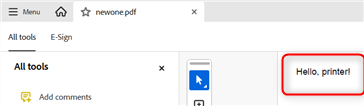

# GTK Prototype Summary

<!--- This overall description fits for every prototype technology --->
This summary belongs to prototyping work on evaluating technology candidates to be used for a new implementation of the Eclipse Standard Widget Toolkit (SWT) layer which is (as far as possible) independent from the operating system. In comparison to the existing SWT implementations that use OS libraries and widgets, a technology for a potential new implementation should already deal with and hide OS specifics, such that an SWT implementation does not have to care about the underlying OS anymore. To this end, the technology must be capable of providing the same features as the union of the existing SWT implementations. In addition, it should be an enabler for further improvement, such as better customizing and theming options, better web integration via web assembly, sophisticated multi-monitor HiDPI support and the like.

The goal of the prototyping phase is not to completely implement the SWT layer with a specific technology, but to provide insights about whether such an implementation is feasible and reasonable. This includes a founded estimation whether or with how much effort this will be possible technology-wise, which developer capabilities are required for development and maintenance, and for what kind of improvements the technology might be an enabler. The results should serve as a means to make an educated decision on whether one or multiple technologies are suitable for an actual implementation of SWT using those technologies and, in case multiple fit, which of them fits best.

## Technology

The technology used in this prototype is GTK which is a popular open-source widget toolkit primarily used on Linux. 
Written in C, GTK is used by major desktop environments like GNOME and by cross-platform applications such as GIMP.
 	GTK is already utilized in the SWT layer to provide GUI services for Linux OS. Although GTK is primarily used on Linux, it has been ported to other platforms (including Windows), making it a suitable choice for cross-platform applications.

### Reasons

**Unified Codebase for Cross-Platform Development:** By using GTK across Linux, Windows, and macOS, SWT can maintain a more unified codebase. This simplifies the development, maintenance, and bug-fixing processes since developers can focus on a single toolkit rather than maintaining separate implementations (e.g., Win32 for Windows, Cocoa for macOS).

**Fewer Platform-Specific Bugs:** Since the same toolkit is used across platforms, the chances of encountering platform-specific bugs and inconsistencies are reduced, leading to more predictable application behavior.

**Open Source Licensing:** GTK is open-source and free to use, providing flexibility without the licensing restrictions or proprietary limitations that may come with other native toolkits like Win32 (Windows) or Cocoa (macOS).

**Customizability:** GTK offers a high degree of flexibility, allowing developers to customize the look and behavior of widgets across all platforms if needed.

**Consistent Look Across Platforms:** With GTK, developers can apply consistent [theming](gtkCustomTheme.md) across platforms, providing a uniform user experience. While GTK also integrates with the native platform’s look and feel, using a common toolkit allows for better control over consistent UI design across all operating systems.

**Actively Maintained:** GTK is open-source, widely adopted, and actively maintained, which ensures ongoing updates, community support, and alignment with modern UI trends.

**Existing prototype work :** Existing prototype work can be used and extended for further experiments and analysis.

### Details

<!-- What are important details of the according technology/technologies? How do they work in a nutshell, who maintains ports to other operating systems etc.? -->

#### GTK on Windows OS : Using GTK in SWT layer on Windows OS

SWT uses GTK (GIMP Toolkit) as the underlying windowing system to render UI components like buttons, text fields, menus, etc.
SWT provides a high-level Java API for building graphical applications.
GTK handles the low-level rendering and event processing on the OS.
 SWT uses JNI to call native GTK functions. Through JNI, SWT can invoke GTK functions written in C, allowing Java applications to access native platform capabilities.

SWT integrates with the GTK event loop to handle user input (like mouse clicks, keyboard events, etc.). It translates Java-side event handling into native GTK event handling by managing GTK’s signal and event system.

Each SWT widget (such as buttons, labels, etc.) is backed by a corresponding native GTK widget. For example, SWT.Button maps to a GtkButton in GTK. When a widget is created in SWT, a corresponding GTK widget is also instantiated through native calls.

**GTK Prototype on Windows**
Prototype with [SWT fragment combining GTK and Win32](https://github.com/HeikoKlare/eclipse.platform.swt/blob/gtk-on-windows/) exists\
Reference: https://bugs.eclipse.org/bugs/show_bug.cgi?id=488431.

To install GTK on Windows machines is done by using MSYS2. This method is based on the packages provided by MSYS2, which provides a UNIX-like environment for Windows. It provides packages for many software applications and libraries, including the GTK stack.\ 
Reference: https://www.gtk.org/docs/installations/windows

Detailed explanation on how to setup workspace for SWT to run on windows using GTK is given [here](https://github.com/HeikoKlare/eclipse.platform.swt/blob/gtk-on-windows/bundles/org.eclipse.swt/Readme.GTK.Win32.md).

### Required Skills

- Programming languages: Java, C, C++, JNI (Java native interface)
- Widget toolkit knowledge: GTK, win32 (Understanding of APIs provided by GTK / windows APIs)
- Make file Syntax, Basic Shell scripting (Used to build SWT binaries and modify the `mak` file as required)
- Debugging and troubleshooting skills , Understanding of build process (Compilation, linking and dependencies)

## Contributors

<!-- List the people that have worked on the prototype, in order to (1) acknowledge their work and (2) document whom one might ask to get further information about the prototyping work now or later. Please also give an estimation of the time invest (like person months) to get an impression of how complicated it was to achieve the presented results. -->

Prototyping work has been conducted by:
- [Latha Patil (ETAS)](https://github.com/lathapatil)

Total time invest was about 3 person months

Initial work of GTK prototype is done by :
- [Heiko Klare (Vector Informatik)](https://github.com/heikoklare) 

## Results

<!-- A summary of the results of the prototyping work, including what went well and what did not go well, which artifacts and insights you produced, and which risks you identified for using the technology for a new Eclipse SWT implementation. Please also refer to other sources of information, such as code you developed or documentation you wrote. -->

- **Multiple Display instances creation support :**
  
    Analysis is carried out on whether we can continue creation of multiple SWT's *Display* instances simultaneously like in SWT usnig win32 APIs.
    in SWT , the thread which creates a *Display* instance is distinguished as the UI thread for that display.(Multiple UI threads = Multiple *Display* instances of SWT.)
  
     It has been verified with both GTK3 and GTK4 versions and it is not possible to create multiple *Display* instances of SWT at a time using GTK . The main reason for this is GTK APIs cannot be called by multiple threads.
  
     Application can still run using Single UI thread like how SWT in Linux is currently working.
    "Snippet explorer" is used to test this where we have option to run multiple snippets to run in parallel/serial or with multi-processing where in each snippet is creating a *Display* instance.
  
     Details of the Analysis is provided in the document "Multiple SWT Display instances support using GTK.pptx"

- **Building SWT binaries using GTK4 :**
SWT binaries can also be build using GTK4 on windows OS.
Changes are committed to https://github.com/swt-initiative31/prototype-gtk/commit/0bbc7708db718fd749bf000e3328424376dcbfe4

- **Embedding of other window handles (AWT) :**
  
    It is possible to generate swt-awt-gtk-4966r2.dll on Windows, which allows to run SWT snippets 154, 155, 300, and 361 that use the SWT.EMBEDDED flag.
    The approach followed includes creating a Windows-specific swt_awt_win32.c file, and the respective object file is used in make_win32.mak to build the SWT-AWT binaries.
    However, further verification is needed to determine which scenarios fail.
     I noticed that maximizing the window causes the contents to disappear for  300 and Snippet 361 runs but fails on further interaction.
    The changes are committed to https://github.com/swt-initiative31/prototype-gtk/commit/e5414eb4d83ae109fb2fa3651784d5d234e9cbed

- **Edge browser integration :**
  
    Because GTK does not support the webkitGTK port on Windows OS and if we need to embed the Edge browser, we would have to use Microsoft OLE, which was previously used for SWT with Win32.
   
    The approach followed will be a platform dependent browser which still uses win32 APIs to build SWT binaries for browser support.
    Current approach followed is to reuse the SWT's browser codebase which uses Microsoft OLE and windows libraries and also win32 APIs.
    Using this approach able to build SWT binaries having both GTK and Win32 APIs building together .
    
    - Snippets related to browser are failing at runtime currently.
       - Not able to receive the pointer to Webview2 Controller from OLE framework which uses asynchronous call back.
       - Able to receive the pointer to webview2 Environment which uses asynchronous call back mechanisms

- **PrintDialog :**
  
    `UnsupportedLinkError` is thrown for some of the printer APIs of GTK on Windows OS in SWT (for example, `gtk_enumerate_printers`, `gtk_print_unix_dialog_new`). On a Linux machine, these APIs are located in the `unix-print` directory under GTK3/4. This folder typically contains components for integrating GTK applications with the system's printing capabilities, such as CUPS (Common UNIX Printing System).
  
     On Windows, GTK uses GDI (Graphics Device Interface) for printing. The GTK source code (`gtkprintoperation-win32.c`) contains GDI APIs such as `StartDoc`, `StartPage`, `EndPage`, and `EndDoc`, which are part of `wingdi.h`.
  
  The printer code in Windows SWT needs to be rewritten using the appropriate GTK APIs for Windows. In case appropriate GTK APIs are not found then need to use win32 APIs to support the case.
  
     GTK on Windows offers callback-based printing at the API level but relies on job-based printing via Win32 at the implementation level. SWT using GTK at API level (This has to be rechecked)
  
     Two standalone GTK applications were created using C and Java to test printer operations on Windows OS. Basic operation of printing the text is working. Print to pdf and print to printer is working

- **Performance :**

    A few test cases were written to evaluate the performance of SWT on Windows OS. SWT's performance was compared against GTK and Win32 APIs. The execution times were recorded as follows, and the test cases have been checked in [here](https://github.com/swt-initiative31/prototype-gtk/tree/gtk4-multi-os/tests/org.eclipse.swt.tests/JUnit%20Tests/org/eclipse/swt/tests/junit/performance).
  
| Testcase | Description | GTK4 (partially working)    | GTK3 |Win32 API | Linux (VM) |
|----------|----------|-----------|------------|-----------|-----------|
| SWTTablePerformanceTest    | Populate table with 100000 rows| 2842 ms | 3714 ms     | 8143 ms      |            |
| TextRenderingPerformanceTest    | Render 1000 Labels| 545 ms | 882 ms | 257 ms      |            |
| TextRenderingPerformanceTest    | Render 1000 Text Fields| 1124 ms |2096 ms| 544 ms      |            |
| TextRenderingPerformanceTest    | Render Large Text in StyledText| 30 sec | 17 ms| 17 ms      |            |
| CustomDrawingPerformanceTest | Draw 100000 rectangles | 111 ms | ~200 ms | ~605 ms | |
| DragAndDropPerformanceTest | 1000 drag and drop operations | 332 ms | 327 ms | 645 ms | |
| Test_org_eclipse_swt_widgets_Tree | Existing SWT Testcases | 6155 s| 5411 s |715 s | |

### Achievements

<!-- What did you achieve in terms of concrete prototyping work? That may include code, documentation and other artifacts. What features/functionality can you show with these artifacts? Which milestones did you reach and what functionality do they cover and demonstrate? It would also be great to see some screenshot in specifically this section (which may be outsourced to the Appendix to ease readability of this section). -->

 - Able to decide Multiple Display instances creation is no more supported in SWT on Windows OS if we use GTK3/GTK4 . It is documented in a PPT.
 - Able to build SWT binaries using GTK4 on windows OS which runs almost fine. Each and every snippet is not validated yet.
 - Able to build SWT binaries for AWT component to work in SWT Windows with GTK4 (Able to embed AWT into SWT).
 - Able to build SWT binaries using GTK4 on windows OS with Edge browser integration into SWT but which fails at runtime.
 - Analysis is ongoing regarding GTK's printer APIs on windows OS. Printer code of SWT Linux have to be changed to use cross-platform GTK APIs of printer or need to use Win32 APIs wherever required.
   Standalone GTK application to print text to pdf and to printer is working on windows using GTK4.

### Insights

<!-- What insights did you gain when developing the prototype? What were the central obstacles that might also influence a full SWT implementation based on that technology? What was complicated to achieve? What did take long? -->

- **PrintDialog** 
 On Windows, GTK uses GDI (Graphics Device Interface) for printing.
 The printer code in Windows SWT needs to be rewritten using the appropriate GTK APIs for Windows or need to use win32 APIs wherever required . GTK printer support on Windows OS is limited compared to Linux.
 Two standalone GTK applications were created using C and Java to test printer operations on Windows OS. Each application creates a GTK dialog with a print button, and when the 'Print' button is clicked, a 
 Windows print dialog opens with printing options.
   - Print to PDF: This option allows the user to create a PDF file; Able to print the text to PDF.
   - Print to Printer (Cloud Printer): Print jobs are queued in the cloud printer, which can be viewed via the printer UI, printer can produce printed output(text).

- **Browser** (Edge browser integration)
Browser integration into Windows SWT with GTK is complicated because GTK does not support the webkitGTK port on Windows OS and if we need to embed the Edge browser, we would have to use Microsoft OLE, which was previously used for SWT with Win32.\
Native integration of the Edge browser will take a significant amount of time, as it requires knowledge of GTK, the OLE framework, and Win32 APIs, along with troubleshooting runtime issues that arise during interactions between OLE, GTK, and Win32 APIs.\
Building binaries that incorporate Win32, OLE, and GTK APIs together requires significant effort to identify the necessary libraries for compiling the native code with GTK. While this step has been completed, a proper implementation of SWT tools to embed these changes and the separation of GTK and Win32 APIs for improved code readability still needs to be done once the functionality of browser works at runtime. After all this yet the functionality is not working at runtime and it is complicated to debug and find out root cause.

- **GLCanvas**
GLCanvas works with the OpenGL library via platform-specific implementations (like GLX on Linux, WGL on Windows, or AGL on macOS). To make it work with GTK on windows It has to be implemented completely from the scratch using GTKGLArea.

### Risks

<!-- Which risks do you see for developing an actual SWT implementation based on this technology? Are there still unknown points for which feasibility or complexity cannot be estimated yet? Do you see blockers? -->

- Even though Edge browser integration is not done fully , having both GTK and win32 APIs in SWT might be messy and confusing.
- Edge browser initialization is not working for unknown reason when win32 API is used for all browser related code. Currently this has become a blocker.
- Printer support using GTK on windows OS is limited compared to Linux. Limitations are yet to be checked.
-There is always maintenance effort when platform dependent components are used to support unavailable functionality from GTK.

## Conclusion

<!-- A summarizing statement, based on the previous insights, assessing whether or how far the technology is a suitable candidate for a new Eclipse SWT implementation -->

**Final Assessment:** <!-- Closing assessment statement in one or two sentences; should be sufficient to understand the overall assessment in one minute -->
(Intermediate Assessment)
Using GTK for SWT on Windows can bring cross-platform consistency and modern UI features but may introduce challenges related to limited printer support compared to Linux , native integration (Edge browser integration and if in-case some feature is not available from GTK then have to depend on native APIs), and ongoing support. It is best suited for SWT if that prioritize cross-platform compatibility over adherence to native Windows UI paradigms. 

## Appendix

<!-- (Optional) Additional material, like screenshots of the prototype or the like -->

Output of standalone GTK application (Printer support of GTK on windows)

Print to PDF: 

Print from printer:

