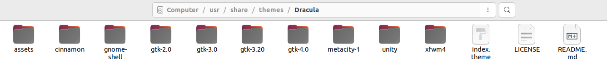
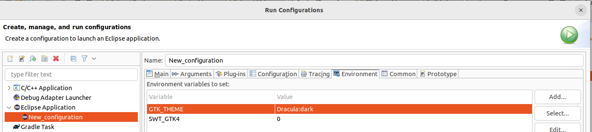
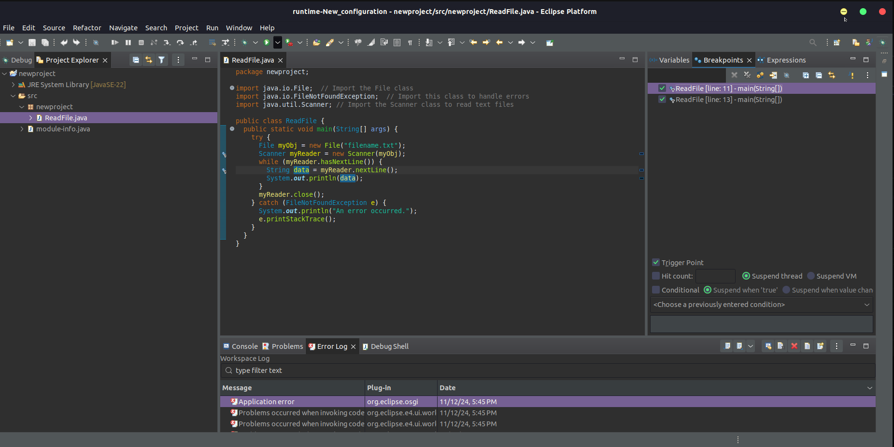
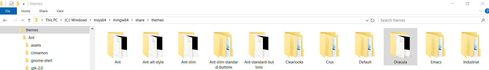
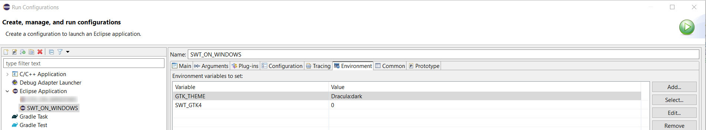
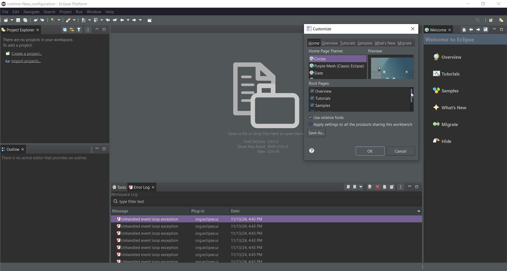
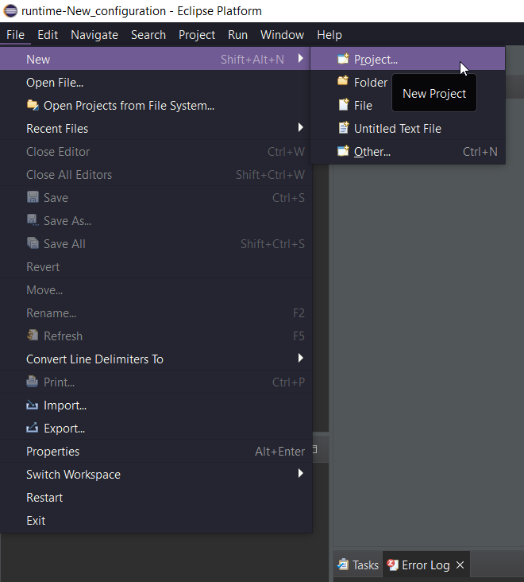
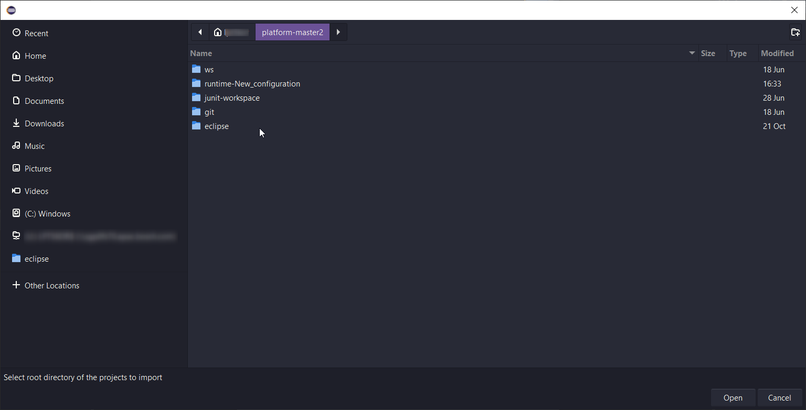

# Custom theming support by GTK

GTK (GIMP Toolkit) provides robust support for theming, allowing users and developers to customize the appearance of GTK-based applications. 

**GTK provides a theme engine** that renders widgets based on the theme selected. Themes are usually defined using CSS (Cascading Style Sheets), where colors, borders, sizes, fonts, and other visual properties are defined.

**Theme Files:** Custom GTK themes are typically stored in directories like `~/.themes` (Linux) or system-wide locations such as `/usr/share/themes`.
On Windows they are located in `C:\msys64\mingw64\share\themes` when Msys2 (mingw64) is used.

**Theme format:** GTK+ 3.x and GTK+ 4.x - These modern versions use CSS for styling. Style rules are defined in gtk.css files, allowing much more flexibility.

**GTK Theme Application:** 
To apply a custom theme in GTK, use the `GTK_THEME` environment variable or configure the settings in the `~/.config/gtk-3.0/settings.ini` file.
GTK automatically detects themes placed in specific directories like `~/.themes` or `/usr/share/themes` or `C:\msys64\mingw64\share\themes` (on Windows with Msys2 and mingw64).

**Eclipse SWT and GTK Custom themes**

  - **SWT on Linux :**
     +  Download custom GTK3/GTK4 themes. (I did it from https://www.pling.com/) . Place it under `/usr/share/themes` location and unzip.

         

     +   Add the `GTK_THEME` environment variable with the value being the name of the themes folder (_e.g._ `Dracula:dark`) in the run configuration of GTK application(Eclipse SWT Application or Control example or Snippets).

          

     +   Run the application to see the effect of the theme.

          
                      
  - **SWT on Windows :**
     +  Download custom GTK3/GTK4 themes. (I did it from https://www.pling.com/) .  Place it under `C:\msys64\mingw64\share\themes` location and unzip.

         

     +   Add the `GTK_THEME` environment variable with the value being the name of the themes folder (_e.g._ `Dracula:dark`) in the run configuration of GTK application(Eclipse SWT Application or Control example or Snippets).

           

     +   Run the application to see the effect of the theme.

          

          

          Browse File System from Eclipse (Windows)

          
                      
