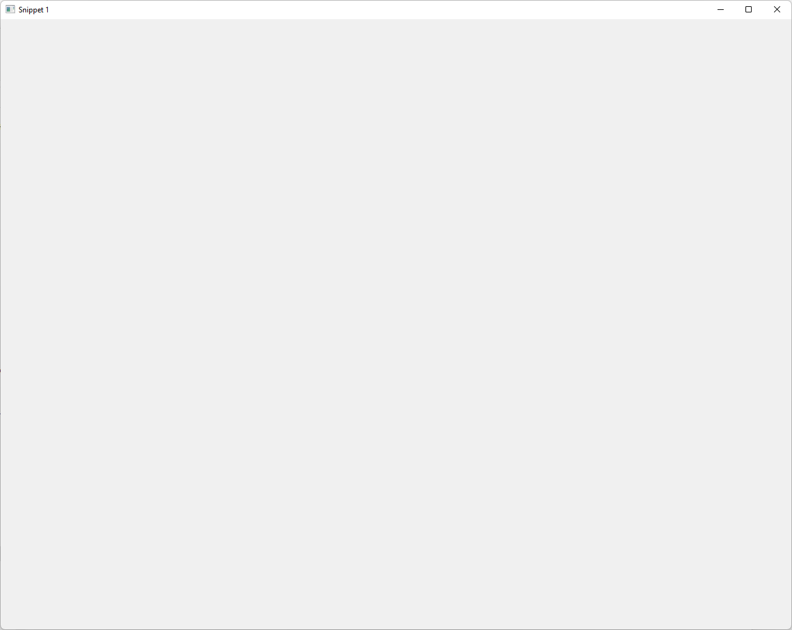
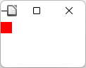
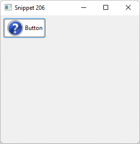
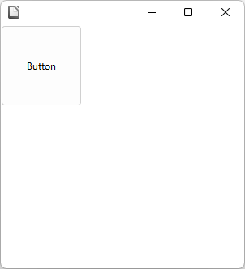

# Skia/VCL Prototype Summary

<!--- This overall description fits for every technology, not only for Skia/VCL --->
This summary belongs to prototyping work on evaluating technology candidates to be used for a new implementation of the Eclipse Standard Widget Toolkit (SWT) layer which is (as far as possible) independent from the operating system. In comparison to the existing SWT implementations that use OS libraries and widgets, a technology for a potential new implementation should already deal with and hide OS specifics, such that an SWT implementation does not have to care about the underlying OS anymore. To this end, the technology must be capable of providing the same features as the union of the existing SWT implementations. In addition, it should be an enabler for further improvement, such as better customizing and theming options, better web integration via web assembly, sophisticated multi-monitor HiDPI support and the like.

The goal of the prototyping phase is not to completely implement the SWT layer with a specific technology, but to provide insights about whether such an implementation is feasible and reasonable. This includes a founded estimation whether or with how much effort this will be possible technology-wise, which developer capabilities are required for development and maintenance, and for what kind of improvements the technology might be an enabler. The results should serve as a means to make an educated decision on whether one or multiple technologies are suitable for an actual implementation of SWT using those technologies and, in case multiple fit, which of them fits best.

## Technology

The technology used in this prototype is the graphics library [`Skia`](https://skia.org/) in combination with the widget framework implementation [`Visual Class Library (VLC)`](https://docs.libreoffice.org/vcl.html) used internally in and implemented for the open-source office suite [LibreOffice](https://de.libreoffice.org/).

_Note:_ There is also the [`Visual Component Library (VCL)`](https://en.wikipedia.org/wiki/Visual_Component_Library) for Microsoft Windows applications, which is _not_ the technology used for this prototype. It is Windows specific und thus not a suitable candidate for a new SWT implementation.

### Reasons

The overall reasons for considering the combination of Skia and VCL for implementing SWT are the maturity and wide adoption of Skia as a rendering engine and VCL as a widget framework used by a long standing open-source product such as LibreOffice, which might also be an enabler for a UI-level integration of LibreOffice applications with Eclipse SWT-based applications.

Skia is a mature 2D graphics library used as the graphics / rendering engine for several modern desktop applications, such as Chrome, Firefox, Thunderbird, Android, LibreOffice, and others. Still, Skia is only a graphics engine providing drawing capabilities. It does, in particular, not provide widgets.
There are several reasons for using Skia:
- Mature and future-proof: The number of applications using it emphasizes its maturity and gives some certainty that it will continue to exist and be maintained
- Features: GPU-supported rendering, SVG support etc.
- Platforms: major desktop OSes (Windows, macOS, Linux) but also mobile platforms (iOS, Android)

The Visual Class Library (VCL) is the widget framework used by and developed for LibreOffice. It uses Skia as a rendering backend.
Reasons for using VCL from LibreOffice are:
- Mature: LibreOffice is a long-standing application requiring a sophisticated widget framework
- Uniqueness: VCL is the only mature and long-existing desktop widget toolkit based on Skia known to us
- Integration: Using VCL could enable a UI-level integration of LibreOffice with Eclipse SWT-based applications
- Web provision: For LibreOffice, [a WebAssembly port is available](https://wiki.documentfoundation.org/Development/WASM) (based on Qt instead of Skia as a backend), which might be an enabler for running  SWT-based applications in a browser

### Details

#### Skia

- [`Skia`](https://skia.org/) is a graphics engine for rendering 2D graphics
- It provides hardware-accelerated rendering capabilities based on Vulkan/OpenGL
- It only allows to draw primitives, such as a lines or rectangles, and render fonts, but does not provide a widget toolkit
- It is one of the backends of LibreOffice and its widget toolkit VCL, next to others like Qt or OS-native implementation based on GTK or Win32
- VCL puts an abstraction layer on top of Skia (via widgets), which is why clients (such as SWT would be) don't need to interact with Skia directly but can do that via this abstraction layer
- Still directly accessing some Skia graphics canvas might be useful for performant rendering of completely custom-drawn parts

#### Visual Class Library (VCL)

- [Visual Class Library (VCL)](https://docs.libreoffice.org/vcl.html) is the internal widget toolkit of LibreOffice
- It is implemented for multiple backends, such as Qt, GTK and OS-specific backends like Win32, see [this blog post](https://dev.blog.documentfoundation.org/2023/01/28/vcl-example-applications-and-tools/)
- VCL supports Cairo and Skia as rendering engines, of which the latter is supposed to replace the former and was [introduced with LibreOffice 7.0 for Windows](https://wiki.documentfoundation.org/ReleaseNotes/7.0)

#### Unified Network Objects (UNO)

- [Unified Network Objects (UNO)](https://en.wikipedia.org/wiki/Universal_Network_Objects) are a component model for cross-platform and cross-programming-language interoperability used by LibreOffice
  - Can be used for function calls by external programs (e.g., for exporting an open document file as a PDF)
  - Can be used to create and provide LibreOffice extensions, including UI extensions with according widgets
  - Serves as a (stable) API to create VCL widgets
  - Has bindings for different programming languages, [such as Java](https://wiki.documentfoundation.org/Documentation/DevGuide/Professional_UNO#Java_Language_Binding)
- The extension mechanism can be used as a means to create a UI (VCL widgets) via UNO
- UNO uses inter-process communication, i.e., extensions usually run in a different process than the application itself

### Required Skills

Specific skills for this technology include:
- C/C++ knowledge
- `make`-based builds
- Inter-process communication

## Contributors

Prototyping work has been conducted by:
- [Denis Ungemach (SAP)](https://github.com/DenisUngemach)
- [Michael Schneider (SAP)](https://github.com/schneidermic0)
- [Federico Jeanne (Vector Informatik)](https://github.com/fedejeanne)
- [Heiko Klare (Vector Informatik)](https://github.com/heikoklare)

Total time invest was about 6 person months.

Additional input from LibreOffice developers:
- Hossein Nourikhah <hossein@libreoffice.org>
- Caolán McNamara <caolan.mcnamara@collabora.com>

## Results

The results consist of concrete prototyping work with an according process documentation and code implementation as well as insights and a risk assessment gained out of this process. The documentation and code can be found here:
- Tasks documented in GitHub issues: https://github.com/swt-initiative31/Skia/issues \
  Organized on a project board: https://github.com/orgs/swt-initiative31/projects/1/views/1
- LibreOffice code with adaptations of VCL: https://github.com/swt-initiative31/prototype-skia-libreoffice/tree/vcl-4-swt
- SWT code with adaptation to VCL: https://github.com/swt-initiative31/prototype-skia/tree/skia-poc

### Achievements

- In summary, preliminary implementations of some SWT widgets have been created, such that some SWT snippets can be executed using Skia/VCL
- Usage of VCL and UNO have been compared
- LibreOffice developers have been contacted giving some insights on the problems with and roadmap for VCL/UNO

#### Via VCL

- Created a `vcl4swt` build module to provide VCL independent from a complete LibreOffice product, also accessible from Java via JNI
- Created simple C++ test applications using VCL
- First attempts to access VCL via JNI, see [this test application](https://github.com/swt-initiative31/prototype-skia-libreoffice/pull/1/files#diff-b0a5e2364d9e854031c32fce74dcbf8195b1c5e56ae9dfd6514b2dfa4b25ce44) and [this issue](https://github.com/swt-initiative31/Skia/issues/7)
- First attempts to access VCL via FFM, see [this post](https://github.com/swt-initiative31/prototype-skia-libreoffice/pull/1#issue-2357211015) and [this issue](https://github.com/swt-initiative31/Skia/issues/5)
- Experimental code is provided via [this pull request](https://github.com/swt-initiative31/prototype-skia-libreoffice/pull/1)

#### Via UNO

- Created an OS-agnostic SWT fragment with experimental, partial implementations of several SWT widgets using UNO
  - The according PR with the changes can be [found here](https://github.com/swt-initiative31/prototype-skia/pull/1)
  - The SWT fragment compiles (but snippets, examples etc. do not compile yet)
  - Specific, working snippets (or extracts of them) have been moved to the SWT fragment for demonstration purposes
- Several increments, as documented [here](https://github.com/swt-initiative31/Skia/issues/13), have been realized
  - Simple application: [Starting a shell](https://github.com/swt-initiative31/Skia/issues/12)
    - Window is shown properly
    - Window title cannot be set easily via Uno (as it is to be set by the LibreOffice application, always showing the current document's title)
    - Example: [Snippet1](#snippet-1-window)
  - Non interactive widget: [Label with image](https://github.com/swt-initiative31/Skia/issues/15)
    - Capable of showing a label with text and image
    - No styling support (plain label only)
    - Using an image requires first rendering the image to a separate, temporary window to then reuse it for the label
    - Example: [Snippet34](#snippet-34-label-with-image)
  - Interactive widget: [Button](https://github.com/swt-initiative31/Skia/issues/14)
    - Reacts to click events
    - Partial implementation of colors, but no patterns
    - No support for radio/check buttons (only push buttons), no further styling support
    - Does not support images
    - Example: [Snippet206](#snippet-206-button)
  - Asynchronous UI thread access: [Progress bar update from non-UI thread](https://github.com/swt-initiative31/Skia/issues/16)
    - `Display.syncExec()` and `Display.asyncExec()` can be used from different threads to schedule processing in the UI thread
    - Progress bar implemented, supporting changes of its value
    - Progress bar can be updated from other thread via `Display.asyncExec()`
    - Example: [Snippet56](#snippet-56-progress-bar)
- Debugging of underlying C++ code is possible via GDB integration in Eclipse
- General limitation: no layouting support (i.e. grid layouts, fill layouts etc. do not work, only absolute positioning)

### Insights

#### Roadmap and Limitations

This information is based on an e-mail correspondence with LibreOffice developers Hossein Nourikhah and Caolán McNamara:
- LibreOffice lacks a good cross-platform UI/widget solution (similar to SWT)
  - In particular, there is no standalone implementation of widgets based on Skia, but just several mappings of VCL to other widget frameworks like GTK, Qt or Win32
  - By lack of alternatives, they particularly use OS-native APIs
- The UNO API must be kept stable (technologically and content-wise), as many clients are relying on it, which is a burden
- LibreOffice knows two valid ways to define UI:
  - Via `.ui` files that can natively be parsed by GTK ([GtkBuilder](https://en.wikipedia.org/wiki/Glade_Interface_Designer) format) and for which also interpreters for other backends are implemented
  - Via UNO as used by extensions (is considered "kludge" by the developers: "and creating dialogs/widget is kludgely IMO, but it's doable at least")
- Since SWT UIs are imperatively programmed and not defined descriptively, using `.ui` descriptions is not an option; at the same time using UNO is considered "kludge"
- Direct usage of VCL is de-facto deprecated (see subsequent section)

#### Tight Integration of VCL into LibreOffice

- Both VCL and UNO are not intended to be used as a standalone widget toolkit outside of LibreOffice
  - Indicated by statements from LibreOffice developers
  - Visible at limited (out-of-the-box) usability of UNO as a widget toolkit\
    Simple example: changing window title is not possible
- VCL is not supposed to be used by other applications than LibreOffice
  - Direct access to VCL widgets is discourage with an error message "don't use this in new code", see, e.g., the [button header file](https://github.com/LibreOffice/core/blob/a27a5dda1cb92b0eb46f41dfad596e34988737cd/include/vcl/toolkit/button.hxx#L22-L24)
  - Even though VCL can, to some extent, be used independent from LibreOffice, it is tightly integrated into its build process; extracting an independently built module would be some effort, see [this issue](https://github.com/swt-initiative31/Skia/issues/4) and [this issue](https://github.com/swt-initiative31/Skia/issues/2)

#### Complex Usability

- Documentation is not extensive
- Usual order of SWT calls cannot be easily covered by UNO API
  - E.g., for setting the image of a label some hack was required (open dedicated window to copy the image and close it afterwards)
- UNO API is so generic that interaction is complex: retrieving proper interface of elements, accessing peers etc.

#### Inter-Process Communication

- By default, UNO relies on inter-process communication
  - The application (usually LibreOffice) runs in one process, while extensions run in other processes and use the UNO API to speak with the application via inter-process communication
  - Using this for SWT would require the complete UI to be set up via inter-process communication
  - Currently, this would also require a full-blown LibreOffice application to run and be extended via the UNO API
- Direct communication between a Java program and the UI (created via UNO) could be achieved by creating an external C API for UNO and accessing it via FFM from Java
  - This API does not exist yet and is not intended
  - It is unclear whether this would be something that can be integrated into VCL/UNO in particular from an organizational perspective

#### Feature Capabilities

Due to the faced issues in terms of roadmap and complexity, no further time was invested into deeply evaluating further features. Thus, only preliminary statements about the following features can be made:
- Theming
  - VCL/UNO do not provide native theming support due to the multiple implementations of those abstraction layers
- HiDPI / SVG
  - As of March 2024, LibreOffice does not yet have multi-monitor HiDPI support on Windows (see [this bug report](https://bugs.documentfoundation.org/show_bug.cgi?id=145710) and [this bug report](https://bugs.documentfoundation.org/show_bug.cgi?id=160389))
- WebAssembly
   - In general, LibreOffice can be [compiled for WebAssembly](https://wiki.documentfoundation.org/Development/WASM)
- Browser Integration
  - Like already done in SWT as of now, browsers will potentially need to run in another process while their UI may be embedded
  - It is unclear whether the usage of Skia will provide a benefit in terms of UI integration (if the browser also uses Skia as a rendering backend)
- Accessibility
  - LibreOffice is designed with [good accessibility support](https://www.libreoffice.org/get-help/accessibility/)
  - So VCL should have the capabilities for also providing good accessibility support on top of it
- Embedding AWT/OpenGL/JavaFX/Handles
  - Unclear
- Multiple Displays
  - Unclear
- Testability
  - Widgets can only be accessed via VCL and/or UNO and not provide better UI testing capabilities on their own (such as other UI frameworks do by making elements accessible via IDs)
  - Thus, no benefits in terms of UI testability are expected

### Risks

#### Dependency and Limitations

- Since LibreOffice is the only consumer of VCL so far, VCL is tightly coupled to that application, thus potentially reducing reusability and being limited in use cases outside that specific application
- VCL/UNO would be an external dependency with external forces driving its usability and evolution
- Given the statements about the roadmap for this technology, possibilities for extracting and evolving VCL/UNO are unclear
  - Unclear whether LibreOffice development/developers will allow to extract VCL/UNO into a separate module
  - Unclear whether it will be possible/allowed (from an organizational/roadmap perspective) to add features to VCL/UNO if required for us
- Potentially hardly negotiable limitations such as limited theming capabilities due to being tied to OS implementations (particularly on Windows/MacOS)

#### Complexity and Efforts

- C(++) knowledge is required for initial setup and maintenance
  - Debugging: issues may be rooted in the C++ code of VCL/UNO, thus debugging that code will be necessary, requiring knowledge and additional effort
  - Extension: new features may be required, such that additions to UNO/VCL have to be implemented in C++ code
  - Maintenance: knowledge for fixing bugs in VCL/UNO and for maintaining a separately built VCL/UNO module would be required
- Maintenance efforts
  - In case issues/bugs with VCL/UNO occur, some SWT developer would probably have to fix them if they are not relevant for LibreOffice as the only other consumer of those libraries
  - Due to VCL/UNO only being used by LibreOffice, even though it is mature for usage in that application, usage outside of that application may reveal additional issues whose fixes will not be done via shared efforts but depend on SWT developers as VCL/UNO is not supposed to be a universal framework with the claim to be usable by arbitrary consumers

#### Two-Process Setup

- The two-process setup can lead to unpredictable states between the processes. For example if runtime errors occur, the other process may continue
- The two-process setup may lead to unreliable behavior, such as requested interfaces just being null
- The two-process setup will probably lead to a performance decrease compared to other technologies

## Conclusion

The insights gained while developing a prototypical implementation of parts of SWT using VCL/UNO and through conversations with LibreOffice developers revealed a high number of risks and drawbacks when using VCL/UNO as a technical basis for an additional SWT implementation. The problems with the existing implementations that shall be solved and the benefits that we expect from a new SWT implementation, such as higher configurability and reduced maintenance, are unlikely to be fulfilled by using VCL to a sufficient degree to justify the investment. And potentially they are not even fulfilled at all. Central concerns are as follows:
- Limited configurability: VCL also has multiple (native) implementations
  - Reduces capabilities of VCL due to being tied to the lowest common denominator of all implementation (like for SWT) 
  - Keeping the UNO API stable for all its clients is a burden (like for SWT)
- Complexity: C++ code
  - Difficult to debug and potentially maintain (in particular in two-process setup)
  - Requires according developer knowledge
- Complexity: integration
  - Either additional inter-process communication introduces complexity and risk of running into unexpected/unpredictable states between the processes, potentially unreliable behavior or performance problems
  - Or necessity to add and maintain C API and access it via JNI or FFM
- Complexity: UNO API
  - Rather universal API makes it hard to use
  - Limited documentation
- Efforts: Extracting VCL/UNO out of LibreOffice into a standalone module and maintaining this

In addition to all these rather technical, feature-oriented arguments, complexity and efforts, it is also unclear from an organizational perspective whether the LibreOffice project and their developers want to have their internal widget toolkit to be used for other applications. This means, it is unclear whether it can be extracted into a separate module and maintained and adapted also for other consumers without forking the code. Additional consumers of the library would increase demands in terms of functionality, stability and deployment etc., which is why it may be undesired to further open the VCL widget toolkit for more consumers than only LibreOffice.

**Final Assessment:** In summary of this work, we do not consider Skia/VCL a suitable technology candidate to use for a new Eclipse SWT implementation. This does not concern the suitability of Skia as a rendering engine, which may still be used with some other widget framework on top of it, but only concerns the suitability of VCL.

## Appendix

### Screenshots

Screenshots for several snippets have been taken once based on the SWT version released with Eclipse 2024-09 on Windows and once with the SWT prototype based on VCL provided in [this pull request](https://github.com/swt-initiative31/prototype-skia/pull/1).

#### Snippet 1 (Window)
Existing Win32 implementation:\

VCL/Uno-based implementation:\

#### Snippet 34 (Label with Image)
Existing Win32 implementation:\

VCL/Uno-based implementation:\

#### Snippet 56 (Progress Bar)
Existing Win32 implementation:\

VCL/Uno-based implementation:\

#### Snippet 206 (Button)
Existing Win32 implementation:\

VCL/Uno-based implementation:\

