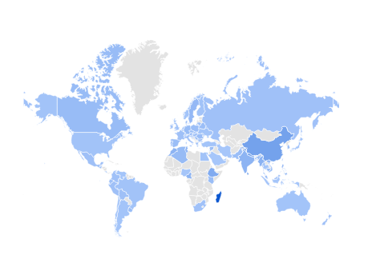
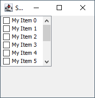
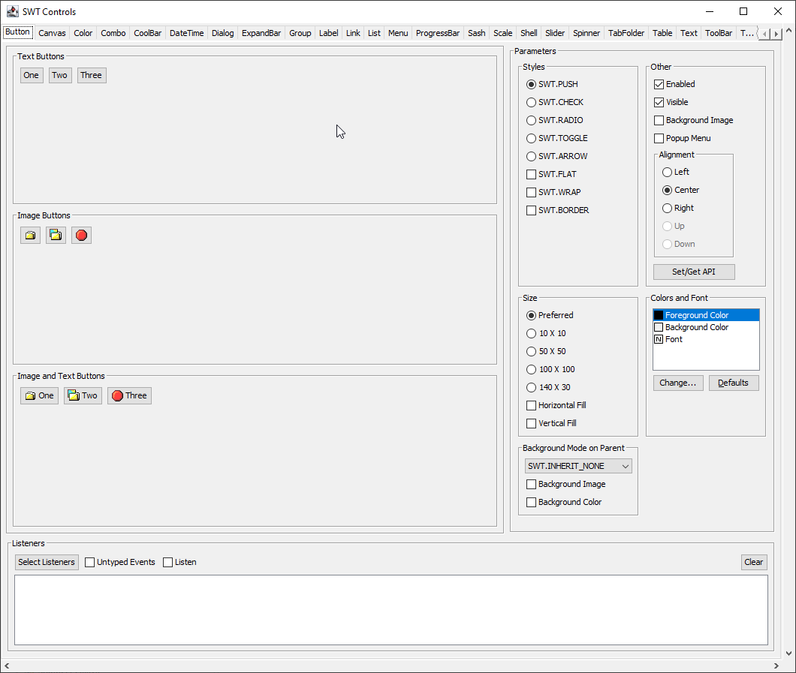
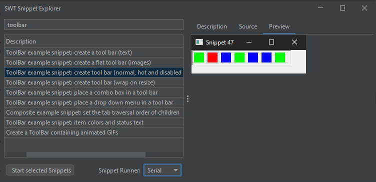
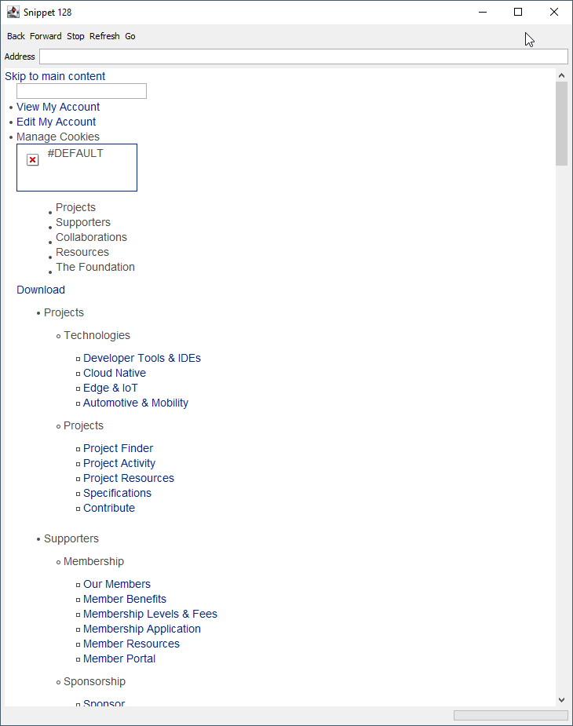
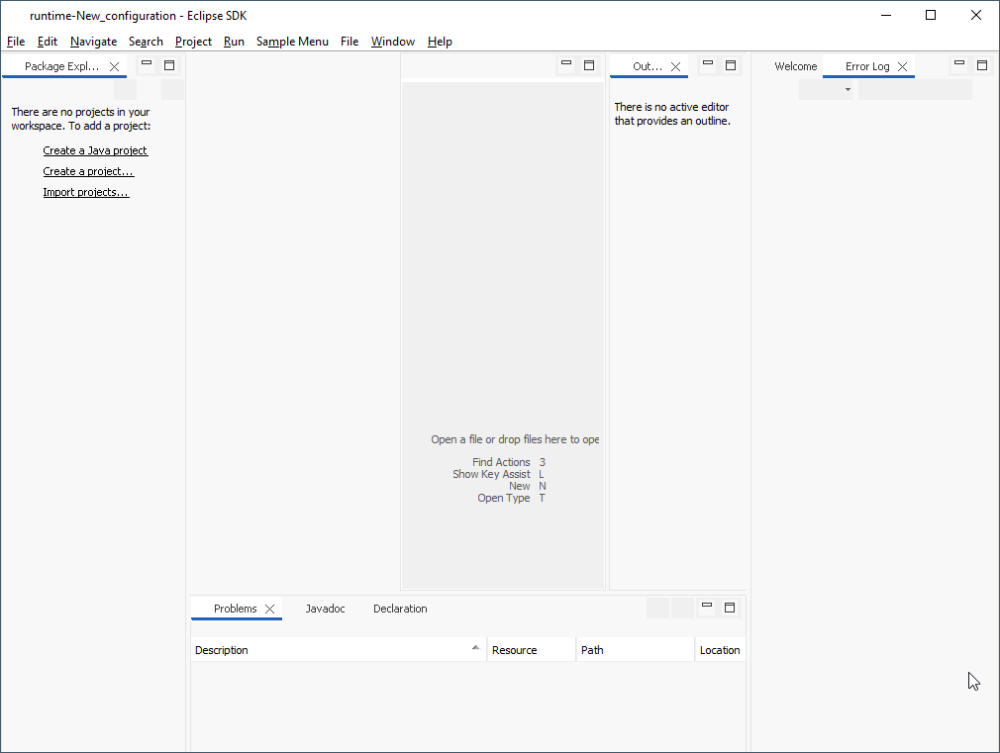
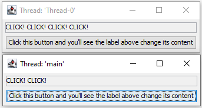
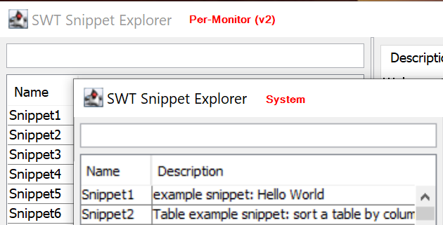

# Swing Prototype Summary

<!--- This overall description fits for every prototype technology --->
This summary belongs to prototyping work on evaluating technology candidates to be used for a new implementation of the Eclipse Standard Widget Toolkit (SWT) layer which is (as far as possible) independent from the operating system. In comparison to the existing SWT implementations that use OS libraries and widgets, a technology for a potential new implementation should already deal with and hide OS specifics, such that an SWT implementation does not have to care about the underlying OS anymore. To this end, the technology must be capable of providing the same features as the union of the existing SWT implementations. In addition, it should be an enabler for further improvement, such as better customizing and theming options, better web integration via web assembly, sophisticated multi-monitor HiDPI support and the like.

The goal of the prototyping phase is not to completely implement the SWT layer with a specific technology, but to provide insights about whether such an implementation is feasible and reasonable. This includes a founded estimation whether or with how much effort this will be possible technology-wise, which developer capabilities are required for development and maintenance, and for what kind of improvements the technology might be an enabler. The results should serve as a means to make an educated decision on whether one or multiple technologies are suitable for an actual implementation of SWT using those technologies and, in case multiple fit, which of them fits best.

## Technology

<!-- Overview of the technology/technologies involved in the prototype, why they were selected and which details are important for using the technology -->

Java's [Swing](https://en.wikipedia.org/wiki/Swing_(Java)).

### Reasons
<!-- What were the reasons for considering this technology/technologies? That may not only include the overall technology, like Gtk, but also reasons for choosing a specific port for another OS or the like. The reasons may go beyond why we initially chose to develop a prototype based on the technology: did you find further benefits during the prototyping work that serve as reasons for choosing the technology? -->

- Multiplatform.
- Standard in Java: 
    - Well maintained.
    - Well documented.
    - Extensive community (expertise):
        - **81.000+** questions in _StackOverflow_ tagged with: [swing](https://stackoverflow.com/questions/tagged/swing) (vs. **6.000+** tagged with [swt](https://stackoverflow.com/questions/tagged/swt) for comparison).
        - Relevant almost all over the world according to [Google Trends
        ](https://trends.google.com/trends/explore?cat=5&q=Swing%20Java&hl=es-419).
        
        
    - Long life expectancy: (quote from the [Java SE Spring 2024 Roadmap Update](https://blogs.oracle.com/support/post/java-se-spring-2024-roadmap-update)) 
        > As announced in the [Java client roadmap update in 2020](http://blogs.oracle.com/java/post/java-client-roadmap-updates), Swing and AWT remain core Java SE technologies. They continue to receive bug fixes and updates on all LTS supported releases and mainline, as warranted by the evolution of the operating systems supported by Oracle Java. 
- Customizable: supports themeing and different themes exist (e.g., **[FlatLaf](https://www.formdev.com/flatlaf/) Darcula**).
- Supports HiDPI by setting the _DPI Awareness_ to `Per-Monitor (v2)` out of the box.
- Supports vectorized icons.
- Initial (unfinished) implementation available:
    - [SWTSwing by nu11ptr (GitHub)](https://github.com/nu11ptr/SWTSwing) (based on [SWTSwing (SourceForge)](https://swtswing.sourceforge.net/main/index.html))

### Details

<!-- What are important details of the according technology/technologies? How do they work in a nutshell, who maintains ports to other operating systems etc.? -->
- Part of the _Java Foundation Classes_ (JFC).
- Delivered as part of the JDK (_e.g._ [**OpenJDK**](https://github.com/openjdk/jdk/tree/master/src/java.desktop/share/classes/javax/swing)).
- Architectural details:
    - Follows the MVC pattern.
    - Single-Threaded.
    - Allows for themeing and "hot replacement" (_i.e._ in runtime).
    - Can embed AWT.

### Required Skills

<!-- What specific skills are required for adopting the technology, e.g., do you require specific programming (language) skills like C/C++? When are they required, e.g., only for setting something up once, or frequently for fixing bugs, debugging etc.? -->
- No special skills required, it's 100% Java.

## Contributors

<!-- List the people that have worked on the prototype, in order to (1) acknowledge their work and (2) document whom one might ask to get further information about the prototyping work now or later. Please also give an estimation of the time invest (like person months) to get an impression of how complicated it was to achieve the presented results. -->

Prototyping work has been conducted by:
- [Denis Ungemach (SAP)](https://github.com/DenisUngemach)
- [Michael Schneider (SAP)](https://github.com/schneidermic0)
- [Federico Jeanne (Vector Informatik)](https://github.com/fedejeanne)
- [Heiko Klare (Vector Informatik)](https://github.com/heikoklare)

Total time invested was about 80 hs or 2 work weeks for 1 person.

## Results

- Swing port (branch): [SWTSwing](https://github.com/swt-initiative31/prototype-swing/tree/SWTSwing).

<!-- A summary of the results of the prototyping work, including what went well and what did not go well, which artifacts and insights you produced, and which risks you identified for using the technology for a new Eclipse SWT implementation. Please also refer to other sources of information, such as code you developed or documentation you wrote. -->

### Achievements

<!-- What did you achieve in terms of concrete prototyping work? That may include code, documentation and other artifacts. What features/functionality can you show with these artifacts? Which milestones did you reach and what functionality do they cover and demonstrate? It would also be great to see some screenshot in specifically this section (which may be outsourced to the Appendix to ease readability of this section). -->

#### Working
- Buttons: Push, Check, Radio.
- StyledText:
	- Setting the font style, foreground and background colors of StyledText (`Snippet163`).
- StyleRange (`Snippet211`).
- Only show Window (`Snippet1`).
- Textbox + Button (`Snippet116`).
- Demonstrator with multiple SWT Display instances (`SnippetDoubleDisplay`).
- `SnippetExplorer`.
- `CustomControlExample`.
-  Embedding of AWT components:
	- Embed Swing/AWT in SWT (`Snippet135`).
	- Embed a `JTable` in SWT without flicker (`Snippet154`).
- Themeing.

#### Working partially
- Browser: custom implementation without CSS support.
- `ControlExample`: the application starts and looks good but some functionality is missing *e.g.* :
    - The **Tooltips** tab does not display any tooltip even though tooltips do work (they appear when one hovers over buttons in other tabs).
    - The **DateTime** widget is not implemented (yet) so its tab is not useful. 
- Eclipse SDK product: the application starts but it has some quirks *e.g.* :
    - **Icons** (images) are not visible: it's not a problem with `ToolItem` because those already display images in a normal SWT application _e.g._ in a modified version of `Snippet47`.
    - Views can not be properly minimized/maximized.
    - Some views have the wrong size.
    - Several errors about _resources not being properly disposed_ are thrown upon ending the application.

#### Not working (yet)
The following topics are not working yet but there is no reason why it shouldn't work, it's just a matter of implementing the functionality.

- `StyledText`:
	- Drag text between two StyledText widgets (`Snippet210`).
	- Draw a box around text (`Snippet244`).
	- Use margins in StyledText (`Snippet316`).
- The `DateTime` widget is not implemented.

### Insights

<!-- What insights did you gain when developing the prototype? What were the central obstacles that might also influence a full SWT implementation based on that technology? What was complicated to achieve? What did take long? -->

- Decent performance: was to be expected (see [SWT vs Swing performance comparison](https://en.wikipedia.org/wiki/Swing_(Java)#cite_note-15)).
- Instantiating a second `Display` is not a problem.
- Several basic stuff were already working (many widgets) but some were left unfinished, calculating the right size of some components like *CoolBars* and *ExpandBars* being the most notorious.
- Activating the anti-aliasing for fonts and graphics is already possible and it can be seen in the `GraphicsExample` snippet (screenshots below).
- The initial implementations (in SourceForge and in GitHub) weren't developed in years which means there was either little appeal to this approach or some impediment that we (yet) don't know about.
- Sub-pixel rendering is not supported out of the box by Swing. The reason for this is that Swing is cross-platform and sub-pixel rendering is highly dependent on the hardware. While there are `RenderingHints` like `VALUE_TEXT_ANTIALIAS_LCD_HRGB` and `VALUE_TEXT_ANTIALIAS_LCD_HBGR` that can be provided to the `Graphics2D`, these do not assure true sub-pixel rendering because they depend on details like the LCD display having a specific pixel disposition (BGR / RGB).

#### First attempt at the Swing port and community reception
_(Summary of [this issue](https://bugs.eclipse.org/bugs/show_bug.cgi?id=69930) and [this thread](https://www.eclipse.org/forums/index.php/t/145268/))._

Years ago, the community asked and voted for the Swing port and provided good arguments for it:
- Portability: using it in environments where SWT was not yet supported
- Usage in secure environments: getting approval to use DLLs in such environments was difficult but since Swing was pure Java, native DLLs wouldn't be necessary
- Avoiding OS-specific issues: Java and Swing would deal with those
- Skinability (*a.k.a.* themeing)
- Performance improvements in the Linux port: back then, SWT was using GTK 2 and some users had reported that the UI was slow.

The port was never officially adopted by the SWT maintainers though. Arguments against it were:
- Big effort
- The mandate of SWT was always _"efficient, portable, **native**"_. 

There were some technical reasons pointed out too but it mostly boiled down to "*it might be doable but the SWT team will not look into it, it's just not worth it*". No blocking technical issues were mentioned back then.

The community responded by supporting the project _SWTSwing_, but that project was never officially adopted by *Eclipse.org* and therefore it didn't get widely adopted. Even though the project made it possible to run SWT applications on top of Swing, apparently it never got to let a full Eclipse application run with it. 

### Risks

<!-- Which risks do you see for developing an actual SWT implementation based on this technology? Are there still unknown points for which feasibility or complexity cannot be estimated yet? Do you see blockers? -->
 - There are no automated performance tests or any kind of benchmarking so the _good_ performance of the Swing port is really only subjective. Moving forward, a clear definition of what "_performance_" means might be needed.

 - The current custom implementation of the Browser (`CBrowserImplementation`) lacks basic functionality like CSS support.

 - Embedding native window handles is not easy out of the box and it requires further investigation.

 - Accessing platform-specific features (like tray icons, native dialogs, etc.) in Swing often requires workarounds or additional libraries like JNI.

 - Swing’s `JTable`, `JTree`, and `JList` can handle large datasets, but managing large amounts of data efficiently can require more custom coding.

 - It is unclear (at least to me) whether or not new features will be added to Swing in the future  or if it will only be maintained _i.e._ bugs will be fixed and security updates will be applied.
 
## Conclusion

<!-- A summarizing statement, based on the previous insights, assessing whether or how far the technology is a suitable candidate for a new Eclipse SWT implementation -->
Based on the amount of effort put into this PoC and the fact that most of it was achieved during a 1-day session in the SAP Hackathon in June, Swing has proven (as expected) to be a good candidate to offer a single multi-platform port for SWT. Lots of the main functionalities are working after the PoC, some are still not (the most important being the **Browser**), performance is acceptable (no flickering while working with the UI) and the fact that there is a foundation to start with makes it a low cost alternative. There are though some caveats that require a deeper analysis, like the quality of the fonts which is (currently) visibly inferior to the quality seen in the OS-dependent ports. One last point is the fact that even though Swing is and will remain part of the JDK for the foreseeable future that doesn't necessarily mean that new features will be added to it, so there's the risk of Swing being outdate in the coming years (this doesn't necessarily mean that it will _look_ outdated since Swing supports themeing). 

**Final Assessment:** <!-- Closing assessment statement in one or two sentences; should be sufficient to understand the overall assessment in one minute -->
Swing looks like a promising alternative to provide a single port of SWT because of its low risks, ease of distribution and because it continues to receive bug fixes and updates. The fact that is 100% Java code also makes it easier to find the necessary expertise in the market. We suggest to keep looking into it and extend the PoC period in order to gain deeper insight regarding open points like improving/replacing the **Browser**, **performance** for complex UIs and, most importantly, the integration of native window handles.

## Appendix

### Screenshots

`Snippet163`: `StyledText`.

`Snippet113`: the size of the scrolled composite is wrong.

`ControlExample`.

`SnippetExplorer` with themeing **[FlatLaf](https://www.formdev.com/flatlaf/) Darcula**.

`Snippet128`: custom Browser with no CSS support.

Bare RCP application (**not** the _sdk.product_): icons are missing.

Double display (`SnippetDoubleDisplay`): works fine.

Fonts sharpness: snapshot of the `GraphicsExample` running on the Swing port without using anti-aliasing for fonts (above) and using it (below).

Graphics sharpness: snapshot of the `GraphicsExample` running on the Swing port without using anti-aliasing for graphics (above) and using it (below).

HiDPI support: Here you can see the `SnippetExplorer` on a 200% monitor using 2 different _DPI Awareness_ modes: *System* and *Per-Monitor (v2)*.

### Interesting links
- [SWTSwing by nu11ptr (GitHub)](https://github.com/nu11ptr/SWTSwing).
- [SWTSwing (SourceForge)](https://swtswing.sourceforge.net/main/index.html).
- [Relationship to SWT](https://en.wikipedia.org/wiki/Swing_(Java)#Relationship_to_SWT).
    - [SWT vs Swing performance comparison](https://en.wikipedia.org/wiki/Swing_(Java)#cite_note-15).
- [Add Swing as a supported platform for SWT (Eclipse Issue Tracker)](https://bugs.eclipse.org/bugs/show_bug.cgi?id=69930).
- [Swing port is coming - Lotus assists IBM! (Eclipse Forum)](https://www.eclipse.org/forums/index.php/t/145268/).
<!-- (Optional) Additional material, like screenshots of the prototype or the like -->
