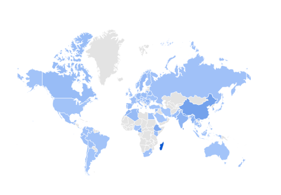
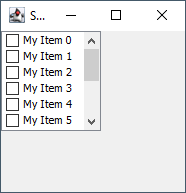
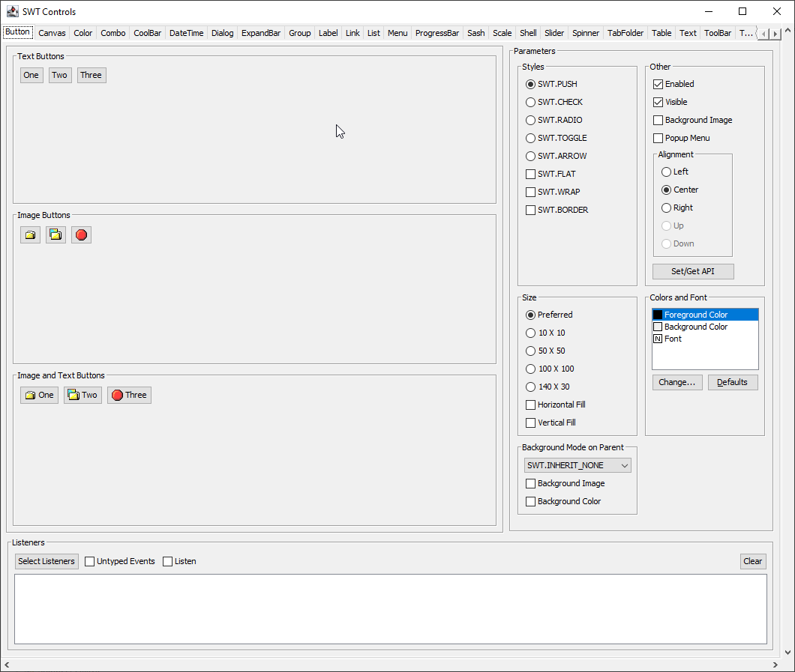
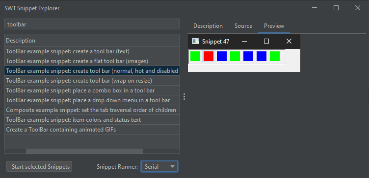

# Swing Prototype Summary

<!--- This overall description fits for every prototype technology --->
This summary belongs to prototyping work on evaluating technology candidates to be used for a new implementation of the Eclipse Standard Widget Toolkit (SWT) layer which is (as far as possible) independent from the operating system. In comparison to the existing SWT implementations that use OS libraries and widgets, a technology for a potential new implementation should already deal with and hide OS specifics, such that an SWT implementation does not have to care about the underlying OS anymore. To this end, the technology must be capable of providing the same features as the union of the existing SWT implementations. In addition, it should be an enabler for further improvement, such as better customizing and theming options, better web integration via web assembly, sophisticated multi-monitor HiDPI support and the like.

The goal of the prototyping phase is not to completely implement the SWT layer with a specific technology, but to provide insights about whether such an implementation is feasible and reasonable. This includes a founded estimation whether or with how much effort this will be possible technology-wise, which developer capabilities are required for development and maintenance, and for what kind of improvements the technology might be an enabler. The results should serve as a means to make an educated decision on whether one or multiple technologies are suitable for an actual implementation of SWT using those technologies and, in case multiple fit, which of them fits best.

## Technology

<!-- Overview of the technology/technologies involved in the prototype, why they were selected and which details are important for using the technology -->

Java's [Swing](https://en.wikipedia.org/wiki/Swing_(Java))

### Reasons
<!-- What were the reasons for considering this technology/technologies? That may not only include the overall technology, like Gtk, but also reasons for choosing a specific port for another OS or the like. The reasons may go beyond why we initially chose to develop a prototype based on the technology: did you find further benefits during the prototyping work that serve as reasons for choosing the technology? -->

- Multiplatform
- Standard in Java: 
    - Well maintained
    - Well documented
    - Extensive community (expertise):
        - **81.000+** questions in _StackOverflow_ tagged with: [swing](https://stackoverflow.com/questions/tagged/swing) (vs. **6.000+** tagged with [swt](https://stackoverflow.com/questions/tagged/swt) for comparison)
        - Relevant almost all over the world according to [Google Trends
        ](https://trends.google.com/trends/explore?cat=5&q=Swing%20Java&hl=es-419)
        
        
    - Long life expectancy: (quote from the [Java SE Spring 2024 Roadmap Update](https://blogs.oracle.com/support/post/java-se-spring-2024-roadmap-update)) 
        > As announced in the [Java client roadmap update in 2020](http://blogs.oracle.com/java/post/java-client-roadmap-updates), Swing and AWT remain core Java SE technologies. They continue to receive bug fixes and updates on all LTS supported releases and mainline, as warranted by the evolution of the operating systems supported by Oracle Java. 
- Customizable: supports themeing and can be made to look modern
- Supports HiDPI
- Supports vectorized icons
- Initial (unfinished) implementation available
    - ([SWTSwing by nu11ptr (GitHub)](https://github.com/nu11ptr/SWTSwing), based on [SWTSwing (SourceForge)](https://swtswing.sourceforge.net/main/index.html))

### Details

<!-- What are important details of the according technology/technologies? How do they work in a nutshell, who maintains ports to other operating systems etc.? -->
- Part of the _Java Foundation Classes_ (JFC)
- Delivered as part of the JDK (_e.g._ [**OpenJDK**](https://github.com/openjdk/jdk/tree/master/src/java.desktop/share/classes/javax/swing))
- Architectural details
    - Follows the MVC pattern
    - Single-Threaded
    - Allows for themeing and "hot replacement" (_i.e._ in runtime)
    - Can embed AWT

### Required Skills

<!-- What specific skills are required for adopting the technology, e.g., do you require specific programming (language) skills like C/C++? When are they required, e.g., only for setting something up once, or frequently for fixing bugs, debugging etc.? -->
- No special skills required, it's 100% Java

## Contributors

<!-- List the people that have worked on the prototype, in order to (1) acknowledge their work and (2) document whom one might ask to get further information about the prototyping work now or later. Please also give an estimation of the time invest (like person months) to get an impression of how complicated it was to achieve the presented results. -->

Prototyping work has been conducted by:
- [Denis Ungemach (SAP)](https://github.com/DenisUngemach)
- [Michael Schneider (SAP)](https://github.com/schneidermic0)
- [Federico Jeanne (Vector Informatik)](https://github.com/fedejeanne)
- [Heiko Klare (Vector Informatik)](https://github.com/heikoklare)

Total time invested was about 80 hs (2 work weeks for 1 person)

## Results

- Swing port (branch): [SWTSwing](https://github.com/swt-initiative31/prototype-swing/tree/SWTSwing)

<!-- A summary of the results of the prototyping work, including what went well and what did not go well, which artifacts and insights you produced, and which risks you identified for using the technology for a new Eclipse SWT implementation. Please also refer to other sources of information, such as code you developed or documentation you wrote. -->

### Achievements

<!-- What did you achieve in terms of concrete prototyping work? That may include code, documentation and other artifacts. What features/functionality can you show with these artifacts? Which milestones did you reach and what functionality do they cover and demonstrate? It would also be great to see some screenshot in specifically this section (which may be outsourced to the Appendix to ease readability of this section). -->

- Basic functionality working
    - Buttons
    - Labels
    - Trees
    - etc
- Several Snippets run
- `SnippetExplorer` runs
- Non-standard themeing works: [FlatLaf](https://www.formdev.com/flatlaf/) was used

### Insights

<!-- What insights did you gain when developing the prototype? What were the central obstacles that might also influence a full SWT implementation based on that technology? What was complicated to achieve? What did take long? -->

- Current implementation of the `Drawable` class can't be used as-is: it introduces **breaking API changes**
- Decent preformance: was to be expected (see [SWT vs Swing performance comparison](https://en.wikipedia.org/wiki/Swing_(Java)#cite_note-15))
- Instantiating a second `Display` is not a problem

### Risks

<!-- Which risks do you see for developing an actual SWT implementation based on this technology? Are there still unknown points for which feasibility or complexity cannot be estimated yet? Do you see blockers? -->
 - Breaking API change in [`Drawable`](https://github.com/swt-initiative31/prototype-swing/blob/SWTSwing/bundles/org.eclipse.swt/Eclipse%20SWT/common/org/eclipse/swt/graphics/Drawable.java): since Swing does not work with `long` handles like Windows/Linux/Mac do, the `Drawable` interface of the Swing port works with a new type called [`CGC`](https://github.com/swt-initiative31/prototype-swing/blob/SWTSwing/bundles/org.eclipse.swt/Eclipse%20SWT%20PI/swing/org/eclipse/swt/internal/swing/CGC.java). In order to make the API compatible again and develop the Swing port side by side with the other ports one would have to introduce a mapping from/to `long` and `CGC` internally, which might affect performance

 - There are no automated performance tests or any kind of benchmarking so the _good_ performance of the Swing port is really only subjective. Moving forward, a clear definition of what "_performance_" means might be needed.

 - The Browser seems to work fine but it's necessary to test it more in detail _e.g._ by opening JavaDocs. For that, a complete RCP application with JDT must run.
 
## Conclusion

<!-- A summarizing statement, based on the previous insights, assessing whether or how far the technology is a suitable candidate for a new Eclipse SWT implementation -->

**Final Assessment:** <!-- Closing assessment statement in one or two sentences; should be sufficient to understand the overall assessment in one minute -->
Swing looks like a promising alternative to provide a single port of SWT because of its low risks, active development and ease of distribution. The fact that is 100% Java code also makes it easier to find the necessary expertise in the market.

## Appendix

### Screenshots

`Snippet163`: `StyledText`

`Snippet113`: layout is wrong

`ControlExample`

`SnippetExplorer` with themeing (**FlatLaf Darcula**)

`Snippet128`: Browser

### Interesting links
- [Relationship to SWT](https://en.wikipedia.org/wiki/Swing_(Java)#Relationship_to_SWT)
    - [SWT vs Swing performance comparison](https://en.wikipedia.org/wiki/Swing_(Java)#cite_note-15)
- [Add Swing as a supported platform for SWT (Eclipse Issue Tracker)](https://bugs.eclipse.org/bugs/show_bug.cgi?id=69930)
- [Swing port is coming - Lotus assists IBM! (Eclipse Forum)](https://www.eclipse.org/forums/index.php/t/145268/)
<!-- (Optional) Additional material, like screenshots of the prototype or the like -->
